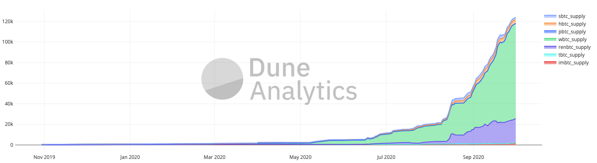
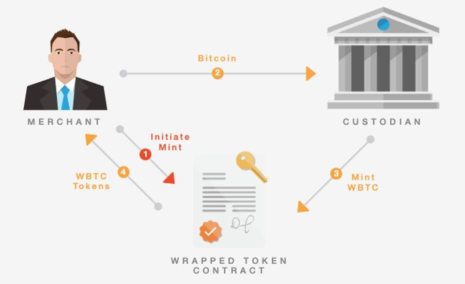
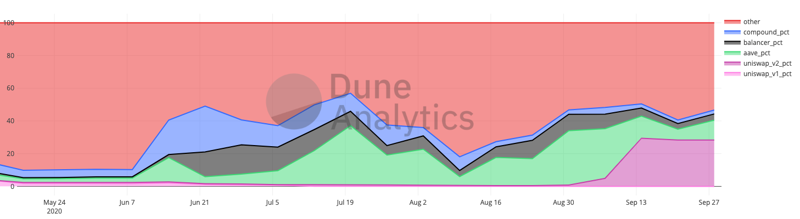

_This article was originally published on [castlefunds.com](https://castlefunds.com)._

Decentralized finance (DeFi) burst onto the scene this summer amidst a flurry of innovation happening on the Ethereum network. Fueled by permissionless software development on top blockchain-enforced contracts, a Cambrian explosion of new projects arose surrounding financial services such as lending, trading, and synthetic asset issuance. But while the 100x returns and catastrophic collapses of some of these projects dominated headlines, a new trend has quietly begun taking hold: More and more bitcoin (BTC) continues to move over to Ethereum.

Since Ethereum’s inception in 2015, the two networks have remained completely separate and incompatible with each other. Recent developments, however, have now enabled investors to lockup their bitcoin on the Bitcoin network and mint "tokenized" BTC on Ethereum, combining Bitcoin’s power as a digital store of value with the diversity of activities available on Ethereum.

At the time of this writing, over 125,000 BTC valued at ~\$1.3 billion dollars is active on Ethereum, up from around 1,000 at the beginning of this year. Represented as ERC-20 tokens, these bitcoins are free to lend, trade, and serve as collateral for a rapidly growing list of DeFi applications. The growth of this new trend has been staggering, with no signs of slowing down despite the recent market volatility.

The most popular mechanism for minting bitcoin onto Ethereum is [BitGo](https://www.bitgo.com/)’s Wrapped Bitcoin (WBTC). The process, illustrated below, involves custodying bitcoin with BitGo and issuing tokenized representations onto Ethereum in a 1:1 ratio. As a KYC/AML compliant process, WBTC mainly caters to large institutions, a list of which can be found on their [online orderbook](https://wbtc.network/dashboard/order-book). In recent months, numerous alternative methods have arisen including [Synthetix](https://synthetix.io/)'s sBTC, [Ren](https://renproject.io/)’s renBTC, and [Keep](https://keep.network/)’s tBTC. All three seek to decentralize this issuance process, either via synthetic representations in the case of sBTC, or trust-minimized collateralization via renBTC or tBTC. To date, however, WBTC accounts for over 74% of all tokenized bitcoin, suggesting this movement is largely driven by institutional players.

What is all this tokenized bitcoin doing on Ethereum? Analysis from [Dune Analytics](https://duneanalytics.com/) shows an uptick in usage this summer across numerous DeFi platforms. Chief amongst these are lending platforms [Aave](https://aave.com/) and [Compound](https://compound.finance/), which have at times offered attractive variable yields on WBTC. Other DeFi applications include [Uniswap](https://uniswap.org/) and [Balancer](https://balancer.fi/), which let WBTC depositors collect trading fees in return for the liquidity provided on their platforms.

Whatever the killer app may end up being, the trend is clear: Tokenized bitcoin is here to stay. We believe that tokenized bitcoin offers the best of both worlds. Namely, that bitcoin holders get access to a myriad array of DeFi applications while keeping the attack surface of the Bitcoin network itself small and highly secure. As the largest, most liquid digital asset with the longest track record, we believe that Bitcoin will continue to exist across multiple domains and will cement itself as the most versatile digital store of value.

_Photo by [Modestas Urbonas](https://unsplash.com/@modestasu) on [Unsplash](https://unsplash.com/)_
