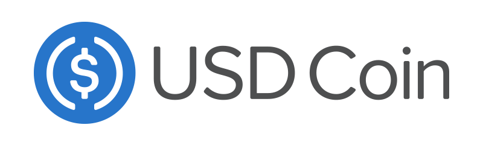
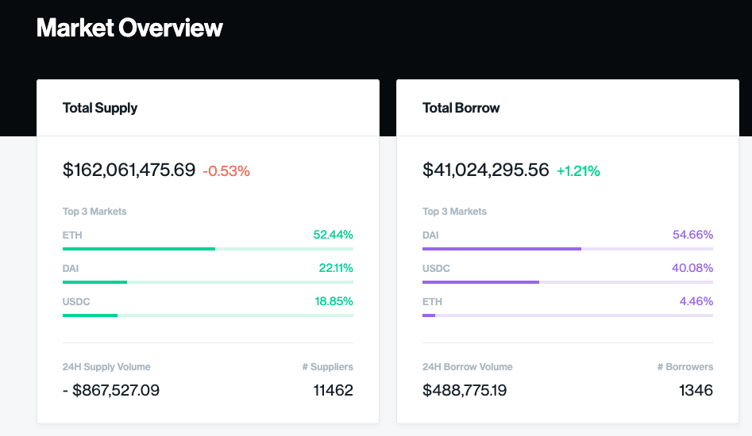

## Introduction

The traditional world of finance is about to undergo a large shift. For the first time, anyone in the world is able to send money to anyone else quickly, cheaply, and without any bank or government's permission. Today, cryptocurrency is a young and volatile speculative instrument. In the coming years, however, it will be the payment rails that enable global financial participation.

A common deterrent for practical applications of [Bitcoin](https://bitcoin.org/) and other cryptocurrencies today is that their prices swing wildly. Overtime, some of these cryptocurrencies may become stable units of account, but for the time being it is extremely difficult to conduct any business in them while their prices fluctuate unpredictably.

To address this problem of price volatility, various blockchain-based tokens have arisen with the sole purpose of maintaining a stable value. These assets are called **Stablecoins**.

## What's a Stablecoin?

A _stablecoin_ is a cryptocurrency designed to minimize the volatility of its price, relative to some stable asset (such as the dollar) or a basket of assets.

Most stablecoins are simple tokens that live on existing blockchains such as Bitcoin or [Ethereum](https://www.ethereum.org/). These tokens are backed 1-1 by real USD sitting in a trusted bank account. While primitive in design, they allow people to get their dollars into the crypto ecosystem so that they can send money over blockchains and interact with various blockchain-based applications. A prime example of this type of stablecoin is [USDC](https://www.coinbase.com/usdc).

Another, more advanced type of stablecoin is one which is backed by a basket of assets. While it remains to be seen how these can hold up during periods of extreme stress, these stablecoins are more decentralized in nature. The most well known example of this is [DAI](https://makerdao.com/dai/).

For the purpose of this primer, we will focus only on **USDC** and **DAI**.

## USDC

_Market cap rank #25 — $412M market cap — $263M daily volume — As of 9/17/2019_

USDC (or "USD Coin") is the most well-known regulated stablecoin, and the most popular regulated stablecoin by both total market cap and daily trading volume. It is an ERC-20 token, which means that it lives on the Ethereum blockchain and can be sent to anyone with an Ethereum address, anywhere in the world, using a small amount of ETH as gas to power the transaction.

While the USDC token lives on the Ethereum blockchain, 100% of all dollars deposited for it are stored in a special bank account administered by [Coinbase](https://www.coinbase.com/)
that is constantly monitored and audited.

Along with the advantage of sending USDC to any address in the world, the digital nature of USDC allows for much easier and programmable lending, payroll, and crowdfunding. It is divisible down to as little as 0.000001 cents.

This system is great for moving dollars in and out of the Ethereum ecosystem, but is ultimately prone to a single point of failure — The special bank account.

## DAI

_Market cap rank #69 — $85M market cap — $4M daily volume — As of 9/17/2019_

Instead of being backed 1-1 by an actual dollar in a bank account, DAI attempts to keep a peg to the US dollar through its parent system, controlled by the cryptocurrency [Maker](https://makerdao.com/). Specifically, Maker gathers Collateralized Debt Positions, or **CDPs,** from people looking to borrow DAI. CDPs began as just ETH, but are expanding to include multiple cryptocurrencies as collateral. Maker itself has a token which has a limited supply and is used to vote on its central banking-like policies via an online organization named MakerDAO.

Assets deposited inside a CDP can only be retrieved once the borrower has paid back the initial DAI they borrowed plus interest. Active CDPs must always hold a higher collateral value than the value of the debt the user has, otherwise they are liquidated and sold off.

MakerDAO/DAI has been in development since 2014, with heavy sponsorship from prominent venture capitalists including Andreesen Horowitz. DAI has been able to handle market fluctuations to this today, but is still considered experimental technology and is riskier than USDC.

Those looking to learn more about the inner workings of this system should check out [Sharon Manrique's overview on DAI](https://medium.com/mycrypto/what-is-dai-and-how-does-it-work-742d09ba25d6).

## The Lending Opportunity

One of the most exciting aspects of stablecoins is the freedom they enable for borrowers and lenders. Instead of asking a traditional bank for a loan, early crypto adopters are able to borrow money directly from their peers via blockchain-based smart contracts that ensure the transaction is fair and the borrower is properly collateralized. These systems of smart contracts act as global liquidity pools, or **money markets**, for crypto.

The most popular crypto money markets today include [Compound](https://compound.finance/), [dYdX](https://dydx.exchange/), and [Fulcrum](https://fulcrum.trade/). For the rest of this primer, we'll focus on **Compound**.

Currently, there exists a big opportunity for lenders to receive outsized returns on their stablecoins. At the time of this writing, lenders can receive **5.21% APR for USDC and 7.43% APR for DAI on Compound** — well above the best in class 2.63% APR returned by the finance app [Wealthfront](https://www.wealthfront.com/).

Who might be borrowing these stablecoins? [Dharma](https://www.dharma.io/), a soon-to-launch frontend for Compound, speculates that these borrowers are often traders taking leveraged positions, or the crypto-rich making large personal purchases with the gains on their cryptocurrencies that have appreciated in value, without having to sell the crypto.

[In a podcast with Laura Shin](https://unchainedpodcast.com/how-youll-earn-interest-on-your-crypto-with-compound-ep-82/), Robert Leshner, the founder of Compound, stated the core demand for borrowing comes from small crypto hedge funds looking to margin trade and/or short in order to differentiate their returns.

## Compound

The leading money market protocol today is Compound. At the time of this writing, over \$160M are earning interest on Compound alone. As a protocol built on the Ethereum blockchain, Compound pools individual crypto positions and algorithmically derives interest rates based on the supply of assets in its pool and the demand to borrow assets. Suppliers and borrowers interact directly with the protocol and use the floating interest rate provided by Compound. Because individual users are not being matched with each other, there is no concept of negotiations, and users are free to enter and exit positions at any time.

Compound is built by a company (also called Compound) which takes a small percentage of the interest from every transaction. The company is led by [Robert Leshner](https://twitter.com/rleshner) and backed with \$8M+ by VCs including Coinbase Ventures. Currently, the company provides a centralized price oracle to the network and controls a few key parameters such as the collateral requirement and the types of markets that are available. Leshner has stated that his goal is to decentralize the company out of the equation in the future.

While the company provides a standard user interface for interacting with the protocol, the open-source nature of the protocol allows any number of third-parties to create their own connections to the network. Already, we are seeing the beginnings of third-party robo-advisor services, such as Dharma and [Staked](https://www.staked.us/).

### How it Works

When users supply assets to the Compound pool address, whether for lending or as collateral, they receive a type of ERC-20 called a **cToken**. There is a different kind of cToken for each asset supported by Compound (i.e. cUSDC in exchange for USDC), but they all share the same basic functionality.

cTokens entitle their owners to an increasing quantity of the underlying asset that was supplied to the pool. As the balances in a money market accrue interest, which is a function of borrowing demand, cTokens become convertible for an increasing amount of the underlying asset.

It is important to note that borrowers also receive interest on the collateral they post to Compound, as the collateral also goes into the liquidity pool and is treated the same as what is lent.

### Benefits

Compound aggregates the supply of each user into a single balance, making each supplied asset a fungible resource available to the protocol. This offers much greater liquidity than direct lending and removes the need for a matching engine. Unless every asset in a market is borrowed, users can withdraw their assets at any time, without waiting for maturity. This also allows for partial withdrawals.

cTokens create an interesting unbundling of money from accounts in the traditional sense. With cTokens, the money itself yields the interest — Not the account. Being ERC-20, cTokens could in theory be sent elsewhere, allow for lenders to programmatically extend their receipts. This is unexplored territory, but could allowing for interesting secondary market dynamics in the future. For now, cTokens are essentially used for 3 things:

1. To track balances and accrued interest for the assets that are lent.
2. As a prerequisite for borrowing from Compound (i.e. you must first put up collateral).
3. to send to cold storage Ethereum addresses.

### Interest Rate Mechanics

Everytime a transaction occurs on Compound, the interest rate is updated to compound the interest since the previous transaction. Since Ethereum's block time is only ~15 seconds, Compound's fastest compounding frequency is roughly 15 seconds, meaning that interest compounds nearly continuously.

### Collateral and Reserves

Compound safeguards lenders through over-collateralization. The amount of collateral required for a loan is based on the quality of the asset supplied, as measured by its liquidity and volume on major exchanges. This is represented as a **collateral factor**.

For example, if I want to borrow 1000 USDC from Compound and the collateral factor is 0.66, the 1000 USDC I am borrowing must never exceed 66% percent of what I supply to Compound as collateral. Whether I supply USDC, or some other crypto such as ETH, the value of that collateral must never drop below \$1500 or I will be liquidated. Liquidation occurs when the value of the collateral provided falls below the borrowing power. This ensures that lenders are always protected from default risk. Since collateral factors constantly adjust based on market conditions, it is my responsibility as the borrower to ensure that they are properly over-collateralized at all times.

Developer Aziz Jalel provides [a convenient tool for calculating this](https://azizjalel.github.io/compoundcalc/).

Compound polls the exchange rates from top cryptocurrency exchanges to determine the borrowing capacity and collateral requirements. This price oracle is currently centralized and polls from Bittrex, Poloniex, Binance, and Coinbase. There are plans to decentralize this oracle in the future.

Each cToken contract has its own reserves, currently set to 10%, which acts as both a liquidity cushion and as funds available for a "just in case" situation.

### Putting it All Together (An Example)

Let’s say you supply 1,000 USDC to the Compound protocol with the intent on earning some interest. The cUSDC/USDC exchange rate at the time is 0.020010, so you receive 49,975.01 cUSDC (1,000/0.020010) as a receipt.

A few months later, you decide it’s time to withdraw your USDC from the protocol. The exchange rate has now risen to 0.022010:

Your 49,975.01 cUSDC is now equal to 1099.94 USDC, (49,975.01 \* 0.022010).

- You could withdraw 1099.94 USDC, which would redeem all 49,975.01 cUSDC.
- You could withdraw a portion, such as your original 1,000 USDC, which would redeem 45,433.89 cUSDC (keeping 4,541.12 cUSDC in your wallet that keeps earning interest).
- You could borrow any asset supported by Compound (such as ETH), as long as the value of whatever you borrow doesn't exceed \$725 (the 1099.94 USDC you have in the pool \* the 66% collateral factor of USDC).

## Conclusion

It might seem like a niche experiment today, but networks like Compound are the first iterations of a new type of financial system — One that is global, with less friction, and easily accessible to anyone with an internet connection.

This new system will not just happen over night. Large technical projects always come with unforeseen bugs and setbacks, and mainstream users will overreact to the headlines that surround them, both good and bad.

It's scary to put real money in a new technology, and especially so when that technology is difficult to understand.

My goal in writing this was to help educate friends and family so they're better prepared to think critically about the systems they invest with — Before they are inundated with ads for exceedingly high returns on their investments.
