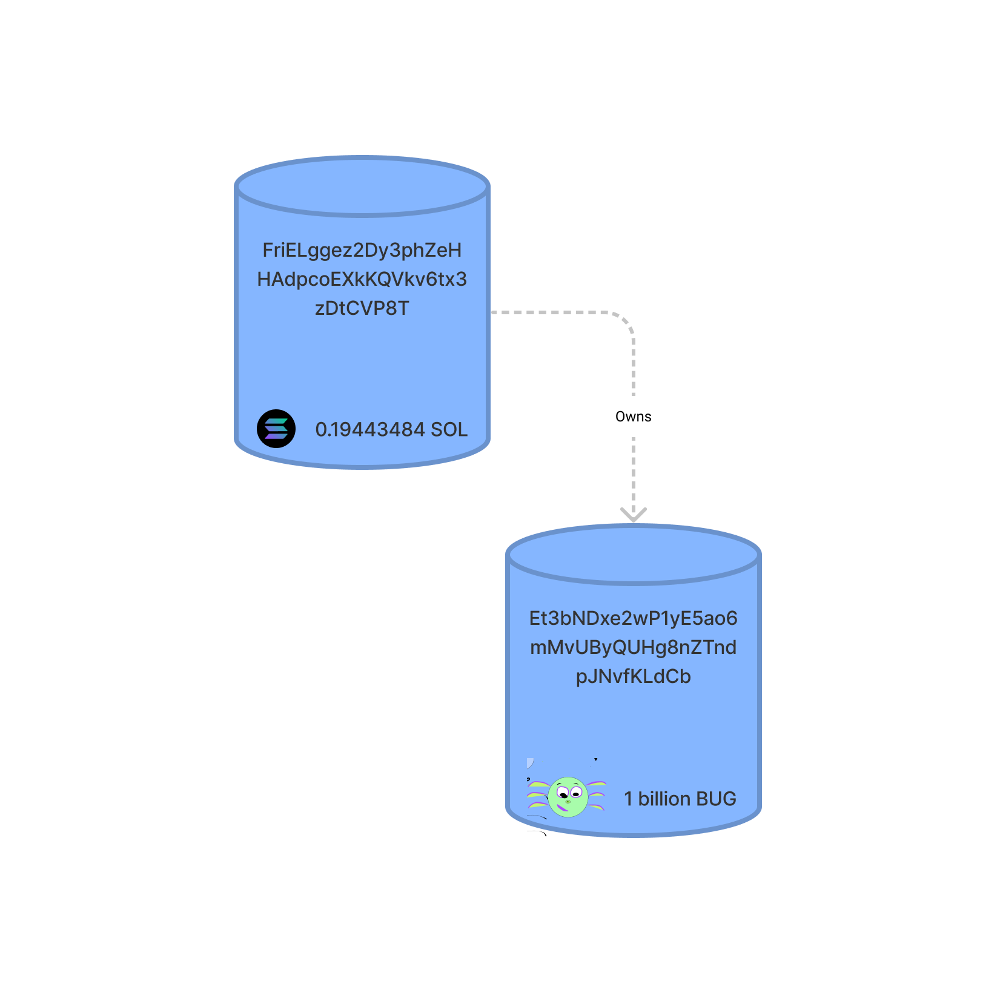

## Introduction

For many newcomers, [Solana](https://solana.com/) can at first appear confusing. Terms like accounts, programs, mints, and authorities can be thrown around haphazardly, with each one meaning something unique to the Solana ecosystem. In contrast to most other blockchains, Solana declined to build on the [Ethereum Virtual Machine (EVM)](https://ethereum.org/en/developers/docs/evm/) and instead built its own [Rust-based architecture](https://github.com/solana-labs/solana) entirely from scratch. As a result, Solana is one of the most performant, yet least well-understood, blockchains in the world.

To better understand the intricacies of Solana, I decided to create my own token and document the process for others to follow. My token is called [BUG](https://explorer.solana.com/address/BUGuuhPsHpk8YZrL2GctsCtXGneL1gmT5zYb7eMHZDWf) and if you can't tell by its official logo it has absolutely zero value so please do not try and buy it.


All in, it cost me a grand total of 0.0035 SOL, or $0.75, to create BUG and mint myself 1 billion units. Sending BUG between two established parties costs less than one-hundredth of one penny, further underscoring Solana's potential in letting everyday people interact with one another on-chain.

My goal in writing this tutorial is help others gain a better understanding of Solana, and in the process, deliver a practical guide to creating tokens.

## Overview

This walkthrough covers three main sections:

1. Creating our token via the SPL-Token Library
2. Adding an official name and logo to our token for the rest of the world to see
3. Interacting with our token via transfers, burns, and account freezes.

In each section, we'll go over the concepts behind what is happening under the hood, with the goal gaining a better understanding of how tokens work on Solana.

## Creating a Token

All tokens on Solana are created using the SPL-token 

<!-- As you may recall, smart contracts on Solana are called **programs**. The Solana Labs team has created a few key programs that serve as building blocks for the rest of the ecosystem to use freely. These programs are known as the Solana Program Library or SPL. If you're familiar with ERC-20 standard on Ethereum. [SPL Token](https://spl.solana.com/token). We can interact with the SPL program via [Rust crates](https://crates.io/crates/spl-token) -->

### Prerequisites

Before we can create anything, we first have to install the necessary command line tools. Namely: [Solana](https://docs.solana.com/cli/install-solana-cli-tools) and the [SPL-Token Library](https://spl.solana.com/token#command-line-utility). I've linked to guides on how to install them which include installing their necessary dependencies such as Rust.

You'll also need to setup a [command line wallet](https://docs.solana.com/wallet-guide/cli) and fund it with SOL in order to pay for the creation of your token. For the purposes of this demonstration, I used a simple [file system wallet](https://docs.solana.com/wallet-guide/file-system-wallet). Make sure you properly back up your recovery phrase.

> 🚨 WARNING: This tutorial covers using real funds on mainnet. Do not fund your wallet with more SOL than you are willing to lose.

If you are not already familiar with using the command line or recovering a wallet from its seed phrase, I recommend following along using fake money on Solana's devnet. I'll cover how you can switch to devnet later on in the tutorial. 

Before proceeding, you should be able to run the following commands in your terminal:

```bash
solana --version
spl-token --version
```

I created my token with the following versions:

```bash
solana-cli 1.7.14
spl-token-cli 2.0.15
```

You should also have already set up a command line wallet, whose address you can check by running:

```bash
solana address
```

At the time of this writing, my setup runs on MacOS 12.0.1. For the purposes of this walkthrough, I won't be covering anything related to other operating systems such as Linux or Windows.

### Understanding What Our Address Signifies

One of the most important concepts to understand in Solana is the [account model](https://solana.wiki/zh-cn/docs/account-model/#account-storage). Accounts can be thought of as storage buckets, capable of storing nearly everything in Solana: from tokens such as SOL and SRM, to a program's state (e.g. integers, strings, public keys), and even entire programs themselves. Every account has a specified owner, and a single owner can own many different kinds of accounts. In addition its owner's address, each account also has its own address so that it is easily identifiable.

To make this tutorial a little easier to follow, I completed this tutorial using vanity addresses that are more human-readable (NB: Vanity addresses are entirely optional, but I've added a quick guide on how you can generate your own at this bottom of this tutorial). For the purposes of this walkthrough, we'll refer to `FriELggez2Dy3phZeHHAdpcoEXkKQVkv6tx3zDtCVP8T` as the address for our command-line wallet. Do note that even if you generate your own vanity address, you will never be able to generate the exact same address I did.


We can visualize our main account with the above diagram. So far

On Solana, token balances are typically stored in unique accounts where the storage account address is derived from the address of the owner account.


with each account storing different types of data

 Each account has an address 


Visually, it looks like this




### Funding our Wallet

### Creating our Token

In Solana, token balances are typically stored in unique accounts where the storage account address is derived from the address of the owner account.

## Naming and Logos

## Transferring, Burning, and Freezing

Associated Token Account Program

A user may own arbitrarily many token accounts belonging to the same mint which makes it difficult for other users to know which account they should send tokens to and introduces friction into many other aspects of token management. This program introduces a way to deterministically derive a token account key from a user's main System account address and a token mint address, allowing the user to create a main token account for each token he owns. We call these accounts Associated Token Accounts.

In addition, it allows a user to send tokens to another user even if the beneficiary does not yet have a token account for that mint. Unlike a system transfer, for a token transfer to succeed the recipient must have a token account with the compatible mint already, and somebody needs to fund that token account. If the recipient must fund it first, it makes things like airdrop campaigns difficult and just generally increases the friction of token transfers. AToken allows the sender to create the associated token account for the receiver, so the token transfer just works.


## Further Integrations
