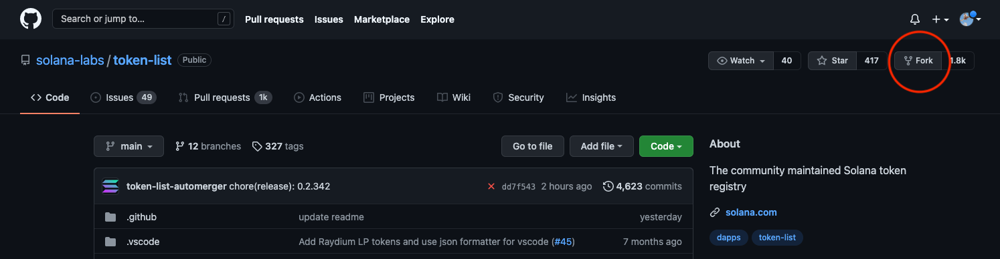

## Introduction

For many newcomers, [Solana](https://solana.com/) can at first appear confusing. Terms like accounts, programs, mints, and authorities are often misunderstood, as each refers to something unique to the Solana ecosystem. In contrast to most other blockchains, Solana declined to build on the [Ethereum Virtual Machine (EVM)](https://ethereum.org/en/developers/docs/evm/) and instead built its own [Rust-based architecture](https://github.com/solana-labs/solana) entirely from scratch. As a result, Solana is one of the most performant, yet least well-understood, blockchains in the world.

To better understand the intricacies of Solana, I decided to create my own token and document the process for others to follow. My token is called [BUG](https://explorer.solana.com/address/BUGuuhPsHpk8YZrL2GctsCtXGneL1gmT5zYb7eMHZDWf) and if you can't tell by its official logo it has absolutely zero value so please do not try and buy it.


All in, it cost me a grand total of 0.0035 SOL, or $0.75, to create BUG and mint myself 1 billion units. Sending BUG between two established parties costs less than one-tenth of one penny, further underscoring Solana's potential to let everyday people interact with one another on-chain.

My goal in writing this tutorial is to help others gain a better understanding of Solana, and in the process deliver a practical guide to creating tokens.

## Overview

This walkthrough covers three main sections:

1. Creating our token via the SPL Token Program
2. Adding an official name and logo to our token for the rest of the world to see
3. Interacting with our token via transfers, burns, and account freezes.

In each section, we'll go over the concepts behind what is happening under the hood, with the goal of gaining a better understanding of how tokens work on Solana.

## Creating a Token

All tokens on Solana, whether they are fungible tokens or NFTs, are created using the [SPL Token Program](https://spl.solana.com/token). SPL stands for [Solana Program Library](https://spl.solana.com/), and is a set of programs (aka smart contracts) that serve as core building blocks for the Solana ecosystem. 

If you're familiar with Ethereum, you can think of SPL tokens as a token standard such as [ERC-20](https://ethereum.org/en/developers/docs/standards/tokens/erc-20/) or [ERC-721](https://ethereum.org/en/developers/docs/standards/tokens/erc-20/). One key difference, however, is that Solana does not require you to deploy a new contract for each token you create. Instead, it simply requires you to send instructions to the Token Program and it will create and mint tokens on your behalf.

We can interact with the Token Program in both on-chain and off-chain applications via [Rust crates](https://crates.io/crates/spl-token), [C bindings](https://github.com/solana-labs/solana-program-library/blob/master/token/program/inc/token.h), and [JavaScript bindings](https://github.com/solana-labs/solana-program-library/blob/master/token/js/client/token.js). For the purposes of this tutorial we'll be using the [Command Line Interface (CLI)](https://spl.solana.com/token#command-line-utility) which is the easiest and most straightforward way to get started. I may explore how you can integrate it with Rust and JavaScript in a future tutorial.

### Prerequisites

Before we can create anything, we first have to install the necessary command line tools. Namely: [Solana](https://docs.solana.com/cli/install-solana-cli-tools) and the [SPL-Token Library](https://spl.solana.com/token#command-line-utility). I've linked to guides on how to install them which include installing their necessary dependencies such as Rust.

You'll also need to set up a [command line wallet](https://docs.solana.com/wallet-guide/cli) and fund it with SOL in order to pay for the creation of your token. For the purposes of this demonstration, I used a simple [file system wallet](https://docs.solana.com/wallet-guide/file-system-wallet). Make sure you properly backup your recovery phrase.

> 🚨 WARNING: This tutorial covers using real funds on mainnet. Do not fund your wallet with more SOL than you are willing to lose.

If you are not already familiar with using the command line or recovering a wallet from its seed phrase, I recommend following along using fake money on Solana's devnet. I'll cover how you can switch to devnet later on in the tutorial. 

Before proceeding, you should be able to run the following commands in your terminal:

```bash
solana --version
spl-token --version
```

I created my token with the following versions:

```bash
solana-cli 1.7.14
spl-token-cli 2.0.15
```

You should also have already set up a command line wallet, whose address you can check by running:

```bash
solana address
```

At the time of this writing, my setup runs on MacOS 12.0.1. For the purposes of this walkthrough, I won't be covering anything related to other operating systems such as Linux or Windows.

### Understanding What our Address Signifies

One of the most important concepts to understand in Solana is the [account model](https://solana.wiki/zh-cn/docs/account-model/#account-storage). **Accounts** can be thought of as storage buckets, capable of storing nearly everything Solana touches: from tokens such as SOL and SRM, to a program's state (e.g. integers, strings, public keys), and even entire programs themselves. Every account has a specified owner, and a single owner can own many different kinds of accounts. In addition to its owner's address, each account also has its own address making it easily identifiable.

To make this all a little easier to follow, I completed this tutorial using vanity addresses that are more human-readable (NB: Vanity addresses are entirely optional, but I've added a quick guide on how you can generate your own at the end of this tutorial). In this walkthrough, we'll refer to `FriELggez2Dy3phZeHHAdpcoEXkKQVkv6tx3zDtCVP8T`, or "Friel", as the address for our command-line wallet. Note that even if you generate your own vanity address, you won't be able to generate the exact same address I did.

#### Funding our Wallet

Let's go ahead and fund our command line wallet with a little bit of SOL. I did 0.2 SOL, but ~$5 worth should be plenty. If you're on mainnet, you can send SOL from an exchange like [FTX](https://ftx.us/home/#a=1490381) or [Coinbase](https://www.coinbase.com/join/friel_t3). If you want to proceed on devnet, open up your terminal and run:

```bash
solana config set --url devnet
```

And then airdrop yourself 0.2 SOL with:

```bash
solana airdrop 0.2
```

Once funded, we can visualize our main account with the below diagram:


So far, there's not a lot going on. The account holds some SOL that we deposited from an external source. It also has an address (in my case, `FriELggez2Dy3phZeHHAdpcoEXkKQVkv6tx3zDtCVP8T`) that we can use to identify it. If you paste your address into a [block explorer](https://explorer.solana.com/), it should look something like this:


### Creating our Token

Let's make things more interesting and create our first token. In our terminal, let's run:

```bash
spl-token create-token --enable-freeze
```

You should immediately see the message: `Creating token <SOME-ADDRESS>`. Copy that address as we'll be using it later.

What just happened? Remember, all we had to do to create a token was to send instructions to the Token Program. Specifically we sent the Token Program two instructions:

1. To create a new account (this is carried out by the [System Program](https://docs.solana.com/developing/runtime-facilities/programs#system-program))
2. To recognize this new account as a Token [Mint](https://docs.solana.com/integrations/exchange#token-mints)

Solana lets us bundle both of these instructions into a single transaction. We can visualize this transaction like so:


If you take a look at [my transaction](https://explorer.solana.com/tx/2wAaKQw2vhraXqM8beFkKm3fgG11zpRrVa3V9XYA6eKfgVn2YmKppQCCgsbstRYHgsib9jz97F4nUZy4EsTVM2bM), you'll see that the entire transaction cost my "Friel" account 0.0014716 SOL or ~$0.31. If you scroll to the "Instructions" section at the bottom of the explorer, you'll see that the vast majority of this fee (0.0014616 SOL) was used to fund the new account we created. This new account is called a **mint** because it will hold all the metadata that describes our token's features, such as its supply, number of decimals, and the various addresses that have authority over parts of it. 

In keeping with the human-readable theme, I initialized this mint at `BUGuuhPsHpk8YZrL2GctsCtXGneL1gmT5zYb7eMHZDWf` or "BUG". If you ran the last command on your own, you initialized your mint at a randomly generated address. I cover how you can use vanity addresses at the end of this tutorial. 

Why did it cost us so much to create an account relative to other transactions on Solana? By creating a new account, we're asking all Solana validators to keep track of the information it stores in memory. To make up for this resource consumption, Solana charges us a time-and-space based fee called [rent](https://docs.solana.com/implemented-proposals/rent), and will close our account if we fail to meet the minimum rent requirements. To get around this, nearly everyone opts to pay a one-time fee to mark their account as "rent-exempt", allowing it to live on in perpetuity.

If we had looked up our token's mint before we actually made any instructions, it would have just appeared as a standard, empty account:


Now, after telling the Token Program to create our account and initialize it as a token mint, the network will recognize it as a mint:


A few things to note:

1. Right away, you should notice that this mint is for an "Unknown Token". This is expected and we will correct this later on in the tutorial
2. Our mint already comes with `Mint Authority` and `Freeze Authority` fields. By default, our "Friel" account is the Mint Authority for this token because it paid for the mint's creation. If you recall back to our last command, we added an `--enable-freeze` flag which also gave our "Friel" account the authority to freeze tokens. If we had not added that special flag, our mint would not have a Freeze Authority and we would not be able to add one in the future. More on that later.
3. The token currently has no supply. Remember, the mint account just holds the metadata that describes our token, it does not hold the tokens themselves. We haven't actually minted any units yet that we can send around. Let's change that.

### Minting our Token

It's time to make ourselves billionaires. Copy the mint address you just created, open up your terminal, and run the following command:

```bash
spl-token mint <PASTE-YOUR-MINT-ADDRESS-HERE> 1000000000
```

You should be met with the following:

```bash
Minting 1000000000 tokens
  Token: <YOUR-MINT-ADDRESS>
  Recipient: <SOME-NEW-ADDRESS>
Account could not be parsed as token account: pubkey=<SOME-NEW-ADDRESS>
```

What's that, an error? Yes. Sorry to lead us astray (I won't do it again) but I can't pass up a good teaching moment.

We just tried to mint ourselves a bunch of tokens, but the recipient appeared to be some new address we hadn't seen before (not "Friel"). Furthermore, the transaction failed because the Token Program told us that it could not parse this new address as a token account. What's going on here?

On Solana, our token balances are each stored in their own unique accounts. These accounts are called [Associated Token Accounts](https://spl.solana.com/associated-token-account), and their addresses are derived from the address of their owner. In my case, I derived `Et3bNDxe2wP1yE5ao6mMvUByQUHg8nZTndpJNvfKLdCb` from my main "Friel" account. The issue is that when we asked the Token Program to mint us some tokens, it derived this new address but did not recognize it as an Associated Token Account for our newly created mint. Instead, it just appeared as a standard empty account. Let's go ahead and fix this with:

```bash
spl-token create-account <PASTE-YOUR-MINT-ADDRESS-HERE>
```

Here's a quick visualization of what just happened:


If we take a look at this [latest transaction](https://explorer.solana.com/tx/D93obissbSVsZpgpRBNrD8HWNBbpyd7yJAAoHce4AZrqw2nrLP43eVBo7eg7CwotpTBxyp6ExXxHjHLqgsMMrfb), we'll see that we are once again paying a relatively large sum to make this new account rent-exempt. In my case, I paid 0.00204428 SOL or ~$0.44 cents. Looking at this newly created account on a block explorer confirms that it is indeed registered as a "Token Account":


With our token account now properly configured, let's try minting ourselves some tokens again:

```bash
spl-token mint <PASTE-YOUR-MINT-ADDRESS-HERE> 1000000000
```

This time, we should see our transaction go through. If we pull up our "Friel" account in a block explorer and navigate the "Tokens" tab, we'll also confirm that we now own 1 billion tokens. We're rich!


## Naming and Logos

> Note: This section only applies to tokens on mainnet

So far, we've been working with our new token mint "BUG", but Solana keeps referring to it as some "Unknown Token". Let's go ahead and change that. At the time of this writing, the official registry of all SPL Tokens lives on [this GitHub repository](https://github.com/solana-labs/token-list) hosted by the Solana Labs team. To get our token recognized, we have to make a pull request in a very specific manner.

First, head on over to the previously mentioned [GitHub repo](https://github.com/solana-labs/token-list) and click the "Fork" button in the top right corner. This will create a forked version that lives on your GitHub account (If you don't already have a GitHub account, please create one now). We'll be using this forked GitHub repo going forward.



Once forked, head back to your personal GitHub page and locate the newly forked repo. This is where we'll be making our additions. If you're not familiar with [Git](https://git-scm.com/), the easiest way to add your token is to open the forked repo with GitHub Desktop like so:


In GitHub Desktop, choose to "Clone a Repository" and then find your newly forked repo.


There are two places where we must add information about our token:

1. In the `assets/mainnet` directory, create a new folder named after your token mint address. In my case, this would be `assets/mainnet/BUGuuhPsHpk8YZrL2GctsCtXGneL1gmT5zYb7eMHZDWf`. Once created, place your logo within this newly created folder and name it `logo.png` (SVG format is also ok). Solana will crop your logo to a square, so make sure you design it appropriately.

2. Locate `src/tokens/solana.tokenlist.json` and open this file with a simple text editor. In this file, locate the `tokens` array and add an object that describes your token like so:

```json
    {
      "chainId": 101,
      "address": "YOUR-MINT-ADDRESS",
      "symbol": "BUG",
      "name": "Bug",
      "decimals": 9,
      "logoURI": "https://raw.githubusercontent.com/solana-labs/token-list/main/assets/mainnet/YOUR-MINT-ADDRESS/logo.png"
    }
```

> 🚨 WARNING: Do not delete or modify any existing info in this file. Only commit additions. If you commit any deletions, your merge request will fail.

This is the part which will cause the majority of issues. Solana Labs uses a bot to automatically test and merge updates to the Token List without requiring human review. To avoid any issues, it's important to take time to ensure that you are not committing any deletions or potential syntax errors. The two mistakes that trip people up the most are:

1. Leaving a trailing comma after the last field in their JSON object (i.e. "," after the string in "logoURI" above).
2. Letting their formatter delete the last line at the bottom of the JSON file. **DO NOT DELETE THIS LINE.** If your IDE is giving you a hard time you can always use Mac's built-in TextEdit app.

Make sure you update the JSON fields with your relevant information. Namely, replace `YOUR-MINT-ADDRESS` with your actual mint address in the `address` and `logoURI` fields. Be sure to also update `symbol` and `name` with values that you want. `decimals` is by default 9, and `chainId` should remain the same. If you are worried about adding more fields like `twitter` or `website`, you can always come back and make more additions later on.

In GitHub Desktop, double check that you are only making additions (only green, no red!). If everything looks good, write a simple commit summary and commit your work in the bottom left corner. Then click "Push Origin".


Your changes should now be visible on the forked token list your GitHub account is hosting. To get these changes merged into the official Solana Labs version, head over to the "Pull Request" tab of their repository [here](https://github.com/solana-labs/token-list/pulls). Then, click on the big green "New pull request" button. On the following screen, click "compare across forks" and then change the "head repository" dropdown option to the `token-list` repository at your personal GitHub. These steps are outlined below:


If all the changes are green, go ahead and click "Create pull request" and then submit it with a title of your choosing. Once submitted, you'll see the bot run its tests. This process will take a few minutes. If you accidentally made any errors, the bot will provide you with feedback. Otherwise, you should see your tests pass.


Congrats! You just created a token on Solana. In a few hours, your changes will be merged into the official token registry. These changes won't be reflected overnight: it may take some services like [Phantom](https://phantom.app/) or the block explorer a few days to pick up the new metadata. You'll know the changes went through when you can view your logo at the `logoUrl` you provided in the JSON object. After a few days, the rest of Solana will pick up on your new branding.


## Transferring, Freezing, and Burning

Ok, we just created a stylish new token. Now what? 

If we turn our attention back to the Token Program, we can see there's a few things we can do right away.

### Transferring Tokens

The first thing we can do is to send some tokens to a friend. If you've used a web wallet like Phantom before, you're probably already familiar with doing this via a UI. But how does this work behind the scenes? 

Once again, we'll be sending instructions to the Token Program. Specifically, we'll be using the [transfer](https://spl.solana.com/token#example-transferring-tokens-to-another-user) command. But there's a catch! Remember back to when we first minted ourselves 1 billion units: we ran into an issue because we did not already have an associated token account to store our token balances. If we try to just transfer a new token to our friend's address, we'll run into the same problem. The issue is that our friend has not already set up an associated token account for our mint.

There are two ways to get around this. The first way is to ask our friend to create and fund their own account just like we did. They could do this by running `spl-token create-account <OUR-MINT-ADDRESS>`. This method, however, is impractical. Our friend may be offline, or we may want to send them some tokens as a surprise gift. To do this, we can choose to create and fund their associated token account for them by adding a `--fund-recipient` flag:

```bash
spl-token transfer <YOUR-MINT-ADDRESS> 1 <YOUR-FRIENDS-ADDRESS> --fund-recipient
```

This is what happens everytime you receive an unexpected airdrop. If you receive a new token without making a transaction, it means the sender is paying the account rent on your behalf! We can visualize this transaction like so:


For [my transaction](https://explorer.solana.com/tx/4uDR3BQTMaX25FFsam2o8hXpvE8xut2Z8j5fvQQmjTbMpUHK5pxdfF9ikbDHCKNtycp6mCfgsdyLShfkopDxYDbQ), I chose to transfer one BUG token from my "Friel" wallet to another wallet I created called "Brian". By plugging my "Brian" wallet into Phantom, we can see that we are now the proud owner of 1 BUG!


### Freezing Tokens

You may recall that when we first created our token, we added an `--enable-freeze` flag. By adding that flag, Solana recognized our "Friel" account as the **Freeze Authority** for our mint "BUG". This grants us the power to disable anyone's BUG token account.

When we gifted 1 BUG to "Brian", we created and funded a token account for him at `CMSC2GeWDsTPjfnhzCZHEqGRjKseBhrWaC2zNcfQQuGS`. Let's freeze that account now:

```bash
spl-token freeze <TOKEN-ACCOUNT-TO-FREEZE>
```

Now Brian's 1 BUG is frozen in place. If we switch over to Phantom and try to transfer it out of our wallet, we'll run into an error:


 
To unfreeze "Brian", we can run the aptly named `thaw` command:

```bash
spl-token thaw <TOKEN-ACCOUNT-TO-UNFREEZE>
```

This is a useful feature to combat illegal activity, but by default it is turned off in Solana. Importantly, if a token is created without setting a freeze authority then it can never be added back in later. This is why we added the `--enable-freeze` flag to our `create-token` command: it gave us optionality. Once we are an authority, we can add or transfer authority to other addresses by using the `authorize` and `revoke` commands. Once we `revoke` all authorities, however, there's no going back.

### Burning Tokens

The other type of token mint authority is known as **Mint Authority**. This one is pretty straightforward, as we used it earlier to mint ourselves 1 billion tokens. When someone creates a new token, their address is granted mint authority by default.

In addition to minting new tokens, the mint authority can also burn existing tokens. Burning in Solana is very explicit: there is no burn address that tokens are sent to. Instead, the Token Program reduces the units in a given token account. When burning tokens, the mint authority must provide the token account address they would like to burn from, otherwise they will by default burn from their own balances.

If we want to follow in Bitcoin's footsteps, we can put a hard cap on the supply of our token by calling `revoke` on all mint authorities. This will prevent anyone from altering our token's supply ever again.

## Next Steps

We covered a lot of material here, but this is all just dependent on Solana's core Token Program. There's a lot more you can do with tokens on Solana, including but not limited to: [Creating Serum Markets](https://docs.projectserum.com/serum-ecosystem/building-on-our-vision/add-a-market-on-serum-serum-academy), [Lending](https://spl.solana.com/token-lending), and [AMM-like swaps](https://spl.solana.com/token-swap). I may explore some of these in a future tutorial.

If you found this tutorial helpful, please let me know via [Twitter](https://twitter.com/bfriel_).

## Bonus: Generating Vanity Addresses

Your seed phrase grants you access to many different private keys, each with their own corresponding public key. We can search these for a public key that looks cool by using the `solana-keygen grind` command.

To find an address that starts with "BUG", I ran:

```bash
solana-keygen grind --starts-with bug:1 --ignore-case
```

The `--starts-with` flag will search for words that start with the next argument (in my case, bug). You can replace bug with a word that you want. The `:1` option tells the CLI to just return the first result it finds. You should keep it at `:1` for now. The `--ignore-case` flag tells the CLI that we don't care if letters are uppercase or lowercase. Keeping it at `--ignore-case` will greatly reduce search time.

Once a result is found, the CLI will print a JSON file with your new vanity address. In my case, it printed `FriELggez2Dy3phZeHHAdpcoEXkKQVkv6tx3zDtCVP8T.json`. This JSON file will live wherever your terminal current is located. You can find that path by running `pwd`.

To use your new vanity address from the CLI you can run:

```bash
solana config set --keypair <PATH/TO/YOUR-VANITY-ADDRESS>.json
```

Note that on Mac, Solana stores your default `id.json` keypair at `.config/solana`. You can check your keypair anytime by running:

```bash
solana config get
```