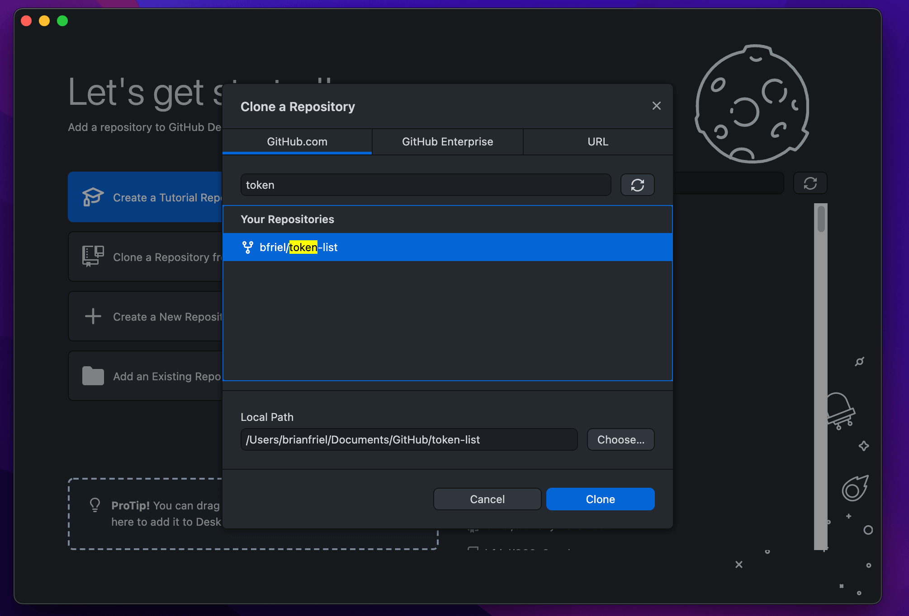

## Introduction

For many newcomers, [Solana](https://solana.com/) can at first appear confusing. Terms like accounts, programs, mints, and authorities can be thrown around haphazardly, with each one meaning something unique to the Solana ecosystem. In contrast to most other blockchains, Solana declined to build on the [Ethereum Virtual Machine (EVM)](https://ethereum.org/en/developers/docs/evm/) and instead built its own [Rust-based architecture](https://github.com/solana-labs/solana) entirely from scratch. As a result, Solana is one of the most performant, yet least well-understood, blockchains in the world.

To better understand the intricacies of Solana, I decided to create my own token and document the process for others to follow. My token is called [BUG](https://explorer.solana.com/address/BUGuuhPsHpk8YZrL2GctsCtXGneL1gmT5zYb7eMHZDWf) and if you can't tell by its official logo it has absolutely zero value so please do not try and buy it.


All in, it cost me a grand total of 0.0035 SOL, or $0.75, to create BUG and mint myself 1 billion units. Sending BUG between two established parties costs less than one-tenth of one penny, further underscoring Solana's potential to let everyday people interact with one another on-chain.

My goal in writing this tutorial is help others gain a better understanding of Solana, and in the process deliver a practical guide to creating tokens.

## Overview

This walkthrough covers three main sections:

1. Creating our token via the SPL Token Program
2. Adding an official name and logo to our token for the rest of the world to see
3. Interacting with our token via transfers, burns, and account freezes.

In each section, we'll go over the concepts behind what is happening under the hood, with the goal of gaining a better understanding of how tokens work on Solana.

## Creating a Token

All tokens on Solana, whether they are fungible tokens or NFTs, are created using the [SPL Token Program](https://spl.solana.com/token). SPL stands for [Solana Program Library](https://spl.solana.com/), and is a set of programs (aka smart contracts) that serve as core building blocks for the Solana ecosystem. 

If you're familiar with Ethereum, you can think of SPL tokens as a token standard such as [ERC-20](https://ethereum.org/en/developers/docs/standards/tokens/erc-20/) or [ERC-721](https://ethereum.org/en/developers/docs/standards/tokens/erc-20/). One key difference, however, is that Solana does not require you to deploy a new contract for each token you create. Instead, its simply requires you to send instructions to the Token Program and it will create and mint tokens on your behalf.

We can interact with the Token Program in both on-chain and off-chain applications via [Rust crates](https://crates.io/crates/spl-token), [C bindings](https://github.com/solana-labs/solana-program-library/blob/master/token/program/inc/token.h), and [JavaScript bindings](https://github.com/solana-labs/solana-program-library/blob/master/token/js/client/token.js). For the purposes of this tutorial we'll be using the [Command Line Interface (CLI)](https://spl.solana.com/token#command-line-utility) which is the easiest and most straightforward way to get started. I may explore how you can integrate it with Rust and JavaScript in a future tutorial.

### Prerequisites

Before we can create anything, we first have to install the necessary command line tools. Namely: [Solana](https://docs.solana.com/cli/install-solana-cli-tools) and the [SPL-Token Library](https://spl.solana.com/token#command-line-utility). I've linked to guides on how to install them which include installing their necessary dependencies such as Rust.

You'll also need to setup a [command line wallet](https://docs.solana.com/wallet-guide/cli) and fund it with SOL in order to pay for the creation of your token. For the purposes of this demonstration, I used a simple [file system wallet](https://docs.solana.com/wallet-guide/file-system-wallet). Make sure you properly back up your recovery phrase.

> 🚨 WARNING: This tutorial covers using real funds on mainnet. Do not fund your wallet with more SOL than you are willing to lose.

If you are not already familiar with using the command line or recovering a wallet from its seed phrase, I recommend following along using fake money on Solana's devnet. I'll cover how you can switch to devnet later on in the tutorial. 

Before proceeding, you should be able to run the following commands in your terminal:

```bash
solana --version
spl-token --version
```

I created my token with the following versions:

```bash
solana-cli 1.7.14
spl-token-cli 2.0.15
```

You should also have already set up a command line wallet, whose address you can check by running:

```bash
solana address
```

At the time of this writing, my setup runs on MacOS 12.0.1. For the purposes of this walkthrough, I won't be covering anything related to other operating systems such as Linux or Windows.

### Understanding What our Address Signifies

One of the most important concepts to understand in Solana is the [account model](https://solana.wiki/zh-cn/docs/account-model/#account-storage). **Accounts** can be thought of as storage buckets, capable of storing nearly everything Solana touches: from tokens such as SOL and SRM, to a program's state (e.g. integers, strings, public keys), and even entire programs themselves. Every account has a specified owner, and a single owner can own many different kinds of accounts. In addition to its owner's address, each account also has its own address making it easily identifiable.

To make this all a little easier to follow, I completed this tutorial using vanity addresses that are more human-readable (NB: Vanity addresses are entirely optional, but I've added a quick guide on how you can generate your own at this bottom of this tutorial). In this walkthrough, we'll refer to `FriELggez2Dy3phZeHHAdpcoEXkKQVkv6tx3zDtCVP8T`, or "Friel", as the address for our command-line wallet. Note that even if you generate your own vanity address, you won't be able to generate the exact same address I did.

#### Funding our Wallet

Let's go ahead and fund our command line wallet with a little bit of SOL. I did 0.2 SOL, but ~$5 worth should be plenty. If you're on mainnet, you can send SOL from an exchange like [FTX](https://ftx.us/home/#a=1490381) or [Coinbase](https://www.coinbase.com/join/friel_t3). If you want to proceed on devnet, open up your terminal and run:

```bash
solana config set --url devnet
```

And then airdrop yourself 0.2 SOL with:

```bash
solana airdrop 0.2
```

Once funded, we can visualize our main account with the below diagram:


So far, there's not a lot going on. The account holds some SOL that we deposited from an external source. It also has an address (in my case, `FriELggez2Dy3phZeHHAdpcoEXkKQVkv6tx3zDtCVP8T`) that we can use to identify it. If you paste your address into a [block explorer](https://explorer.solana.com/), it should look something like this:


### Creating our Token

Let's make things more interesting and create our first token. In our terminal, let's run:

```bash
spl-token create-token --enable-freeze
```

You should immediately see the message: `Creating token <SOME-ADDRESS>`. Copy that address as we'll be using it later.

What just happened? Remember, all we had to do to create a token was to send instructions to the Token Program. Specifically we sent the Token Program two instructions:

1. To create a new account (this is carried out by the [System Program](https://docs.solana.com/developing/runtime-facilities/programs#system-program))
2. To recognize this new account as a Token [Mint](https://docs.solana.com/integrations/exchange#token-mints)

Solana lets us bundle both of these instructions into a single transaction. We can visualize this transaction like so:


If you take a look at [my transaction](https://explorer.solana.com/tx/2wAaKQw2vhraXqM8beFkKm3fgG11zpRrVa3V9XYA6eKfgVn2YmKppQCCgsbstRYHgsib9jz97F4nUZy4EsTVM2bM), you'll see that the entire transaction cost my "Friel" account 0.0014716 SOL or ~$0.31. If you scroll to the "Instructions" section at the bottom of the explorer, you'll see that the vast majority of this fee (0.0014616 SOL) was used to fund the new account we created. This new account is called a **mint** because it will hold all the metadata that describes our token's features, such as its supply, number of decimals, and the various addresses that have authority over parts of it. 

In keeping with the human-readable theme, I initialized this mint at `BUGuuhPsHpk8YZrL2GctsCtXGneL1gmT5zYb7eMHZDWf` or "BUG". If you ran the last command on your own, you initialized your mint at a randomly generated address. I cover how you can use vanity addresses at the end of this tutorial. 

Why did it cost us so much to create an account relative to other transactions on Solana? By creating a new account, we're asking all Solana validators to keep track of the information it stores in memory. To make up for this resource consumption, Solana charges us a time-and-space based fee called [rent](https://docs.solana.com/implemented-proposals/rent), and will close our account if we fail to meet the minimum rent requirements. To get around this, nearly everyone opts to pay a one-time fee to mark our account as "rent-exempt", allowing it to live on in perpetuity.

If we had looked up our token's mint before we actually made any instructions, it would have just appeared as a standard, empty account:


Now, after telling the Token Program to create our account and initialize it as a token mint, the network will recognize it as a mint:


A few things to note:

1. Right away, you should notice that this mint is for an "Unknown Token". This is expected and we will correct this later on in the tutorial
2. Our mint already comes with `Mint Authority` and `Freeze Authority` fields. By default, our "Friel" account is the Mint Authority for this token because it paid for the mint's creation. If you recall back to our last command, we added an `--enable-freeze` flag which also gave our "Friel" account the authority to freeze tokens. If we had not added that special flag, our mint would not have a Freeze Authority and we would not be able to add one in the future. More on that later.
3. The token currently has no supply. Remember, the mint account just holds the metadata that describes our token, it does not hold the tokens themselves. We haven't actually minted any units yet that we can send around. Let's change that.

### Minting our Token

It's time to make ourselves billionaires. Copy the mint address you just created, open up your terminal, and run the following command:

```bash
spl-token mint <PASTE-YOUR-MINT-ADDRESS-HERE> 1000000000
```

You should be met with the following:

```bash
Minting 1000000000 tokens
  Token: <YOUR-MINT-ADDRESS>
  Recipient: <SOME-NEW-ADDRESS>
Account could not be parsed as token account: pubkey=<SOME-NEW-ADDRESS>
```

What's that, an error? Yes. Sorry to lead us astray (I won't do it again) but I can't pass up a good teaching moment.

We just tried to mint ourselves a bunch of tokens, but the recipient appeared to be some new address we hadn't seen before (not "Friel"). Furthermore, the transaction failed because the Token Program told us that it could not parse this new address as a token account. What's going on here?

On Solana, our token balances are also stored in their own unique accounts. These accounts are called [Associated Token Accounts](https://spl.solana.com/associated-token-account), and their addresses are derived from the address of their owner. In my case, I derived `Et3bNDxe2wP1yE5ao6mMvUByQUHg8nZTndpJNvfKLdCb` from my main "Friel" account. The issue is that when we asked the Token Program to mint us some tokens, it derived this new address but did not recognize it as an Associated Token Account for our newly created mint. Instead, it just appeared as a standard empty account. Let's go ahead and fix this with:

```bash
spl-token create-account <PASTE-YOUR-MINT-ADDRESS-HERE>
```

Here's a quick visualization of what just happened:


If we take a look at this [latest transaction](https://explorer.solana.com/tx/D93obissbSVsZpgpRBNrD8HWNBbpyd7yJAAoHce4AZrqw2nrLP43eVBo7eg7CwotpTBxyp6ExXxHjHLqgsMMrfb), we'll see that we are once again paying a relatively large sum to make this new account rent-exempt. In my case, I paid 0.00204428 SOL or ~$0.44 cents. Looking at this newly created account on a block explorer confirms that it is indeed registered as a "Token Account":


With our token account now properly configured, let's try minting ourselves some tokens agains:

```bash
spl-token mint <PASTE-YOUR-MINT-ADDRESS-HERE> 1000000000
```

This time, we should see our transaction go through. If we pull up our "Friel" account in a block explorer and navigate the "Tokens" tab, we'll also confirm that we now own 1 billion tokens. We're rich!


## Naming and Logos

So far, we've been working with our new token mint "BUG", but Solana keeps referring to it as some "Unknown Token". Let's go ahead and change that. At the time of this writing, the official registry of all SPL Tokens lives on [this GitHub repository](https://github.com/solana-labs/token-list) hosted by the Solana Labs team. To get our token recognized, we have to make a pull request in a very specific manner.

First, head on over to the previously mentioned [GitHub repo](https://github.com/solana-labs/token-list) and click the "Fork" button on in the top right corner. This will create a forked version that lives on your GitHub account (If you don't already have a GitHub account, please create one now). We'll be using this forked GitHub repo going forward.


Once forked, head back to your personal GitHub page and locate the newly forked repo. This is where we'll be making our additions. If you're not familiar with [Git](https://git-scm.com/), the easiest way to add your token is to open this with repo with GitHub Desktop like so:


In GitHub Desktop, you will choose to "Clone a Repository" and then find your newly forked repo like so:



There are two places you must make additions to if you want your token to display properly

1. In the `assets/mainnet` directory, create a new folder named after your token mint address. In my case, this would be `assets/mainnet/BUGuuhPsHpk8YZrL2GctsCtXGneL1gmT5zYb7eMHZDWf`. Once created, place your logo within this newly created folder and name it `logo.png` (SVG format is also ok). Solana will crop your logo to a square, so make sure you design it appropriately.

2. Locate `src/tokens/solana.tokenlist.json` and open this file with a simple text editor. In this file, locate the `tokens` array and add an object that describes your token like so:

```json
    {
      "chainId": 101,
      "address": "YOUR-MINT-ADDRESS",
      "symbol": "BUG",
      "name": "Bug",
      "decimals": 9,
      "logoURI": "https://raw.githubusercontent.com/solana-labs/token-list/main/assets/mainnet/YOUR-MINT-ADDRESS/logo.png"
    }
```

> 🚨 WARNING: Do not delete or modify any existing info. Only commit additions. If you commit any deletions, your merge request will fail.

This is the part which will cause the majority of issues. Solana Labs uses a bot to automatically test and merge updates to the Token List without human review. To avoid any issues, its important to take the time to ensure that you are not commiting any deletions or potential syntax errors. The two that trip people up the most are:

1. Leaving a trailing comma after the last field (i.e. "," after the string in "logoURI" above)
2. Letting their formatter delete the last line of the entire json file. DO NOT DELETE THIS LINE. If you are having trouble leaving this line unchanged, you can always use Mac's built-in TextEdit app.

Make sure you update the JSON fields with your relevant information. Namely, replace `YOUR-MINT-ADDRESS` with your actual mint address in the `address` and `logoURI` fields. Be sure to also update `symbol` and `name` with values that you want. `decimals` is by default 9, and `chainId` should remain the same. If you are worried about adding more fields like `twitter` or `website`, you can always come back and make more additions later on.


The easiest way to add your 

## Transferring, Burning, and Freezing

Associated Token Account Program

A user may own arbitrarily many token accounts belonging to the same mint which makes it difficult for other users to know which account they should send tokens to and introduces friction into many other aspects of token management. This program introduces a way to deterministically derive a token account key from a user's main System account address and a token mint address, allowing the user to create a main token account for each token he owns. We call these accounts Associated Token Accounts.

In addition, it allows a user to send tokens to another user even if the beneficiary does not yet have a token account for that mint. Unlike a system transfer, for a token transfer to succeed the recipient must have a token account with the compatible mint already, and somebody needs to fund that token account. If the recipient must fund it first, it makes things like airdrop campaigns difficult and just generally increases the friction of token transfers. AToken allows the sender to create the associated token account for the receiver, so the token transfer just works.


## Further Integrations

## Bonus: Generating Vanity Addresses

For me, I generated my vanity address in the folder `.config/solana`, so my command would have been: `spl-token create-token .config/solana/BUGuuhPsHpk8YZrL2GctsCtXGneL1gmT5zYb7eMHZDWf.json --enable-freeze`