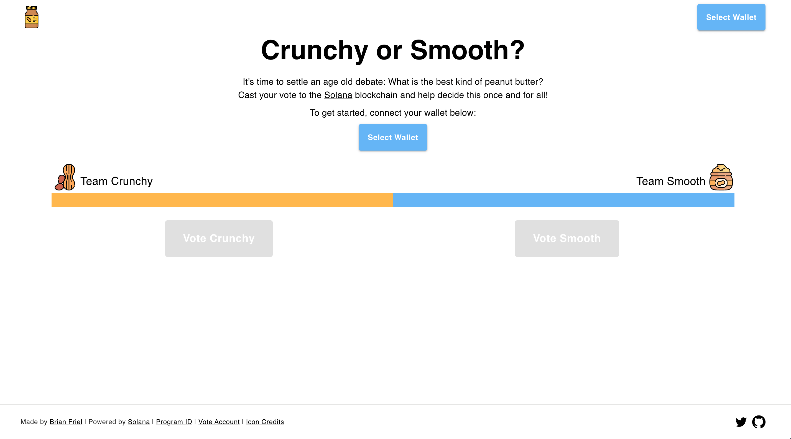
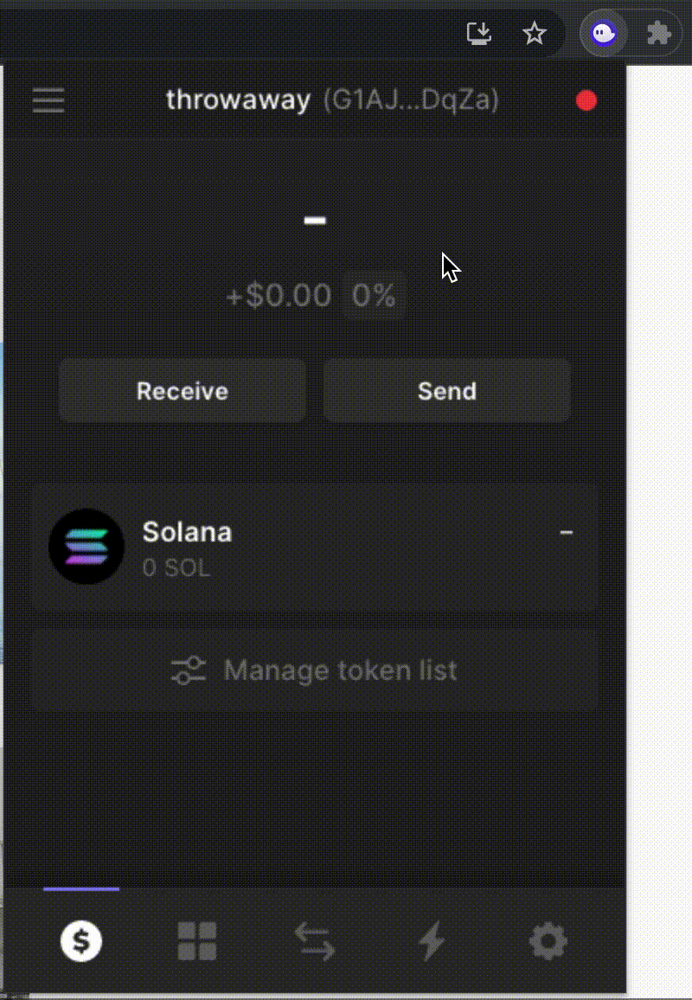
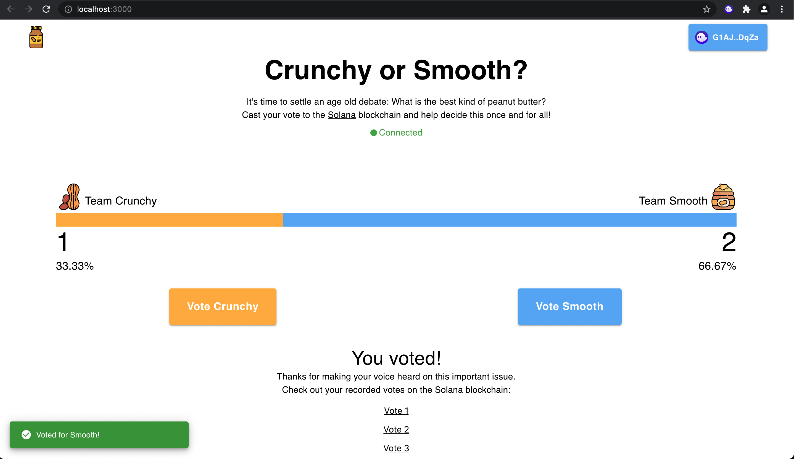

> Check out the [live app](https://www.pbvote.com/) and its [code](https://github.com/bfriel/crunchy-vs-smooth).

## Introduction

About a week ago I was scrolling through Twitter when I came across the following tweet from Armani Ferrante, a software engineer at [Alameda Research](https://www.alameda-research.com/).

[](https://twitter.com/armaniferrante/status/1434554725093949452)

Armani is the creator of [Anchor](https://project-serum.github.io/anchor/getting-started/introduction.html), a framework for developing smart contracts on [Solana](https://solana.com/). Anchor can be thought of like the [Ruby on Rails](https://rubyonrails.org/) of Solana development: It's an opinionated way of writing programs that abstracts away a lot of repetitive, low-level code and lets developers focus on just building their apps.

Up until stumbling upon Armani's tweet, I had been interested in learning how to build on Solana, but had largely put it off due to its perceived time commitment. Unlike most other smart contract platforms, Solana is not natively [EVM](https://ethereum.org/en/developers/docs/evm/)-compatible, meaning the vast majority of Web 3 applications that exist today cannot be easily copied over to Solana. Over the last six years, a huge developer ecosystem has emerged around [Ethereum](https://ethereum.org/en/) that supports writing, testing, and deploying smart contracts written in [Solidity](https://docs.soliditylang.org/en/v0.8.7/). Solana, which launched its mainnet-beta back in March 2020, must build its [Rust](https://www.rust-lang.org/)-based developer ecosystem entirely from scratch.

While Solana is considered new, Anchor is even newer. The framework is still in its infancy and has yet to publish its official v1.0.0 release. The source code is currently unaudited and its APIs change regularly, but its productivity and security enhancements are such that it is quickly becoming the go-to foundation for the majority of Solana developers.

Upon seeing Armani's tweet, I decided it was time for me to learn how to build on Solana. Specifically, I wanted to learn how to build a program using Anchor that I could then interact with via a [React](https://reactjs.org/) application. Having no prior experience with Rust, I set a goal of building a simple voting app that lets the world vote for its favorite type of peanut butter. The live version of this app can be found at [www.pbvote.com](https://www.pbvote.com/) and its source code can be found on [my GitHub](https://github.com/bfriel/crunchy-vs-smooth).

What follows is a walkthrough of my experience and a simple guide for others to follow when building their first Solana application.

## Overview

This walkthrough covers three main sections:

1. Writing our Rust-based Solana program using Anchor
2. Creating our React application to interface with our Solana program
3. Deploying our completed work for the rest of the world to see

## Writing our Rust-based Solana program using Anchor

### Prerequisites

Before we can build anything, we first have to install the necessary command line tools. Chief amongst these are [Solana](https://docs.solana.com/cli/install-solana-cli-tools), [Anchor](https://project-serum.github.io/anchor/getting-started/installation.html#install-rust), and [NodeJS](https://nodejs.org/en/). I've linked to guides on how to install Solana and Anchor which include installing their necessary dependencies such as Rust. If you don't have Node yet, I recommend installing it via [Node Version Manager (NVM)](https://github.com/nvm-sh/nvm).

Before proceeding, you should be able to run the following commands in your terminal:

```bash
solana --version
anchor --version
node -v
```

I developed my app with the following versions:

```bash
solana-cli 1.7.11
anchor-cli 0.16.0
node v16.7.0
```

At the time of this writing, my setup runs on MacOS 11.5.2. For the purposes of this walkthrough, I won't be covering anything related to other operating systems such as Linux or Windows.

#### Getting Started with Anchor

With the necessary tools installed, we can initialize our project by calling `anchor init` and then changing into our project directory.

```bash
anchor init crunchy-vs-smooth
cd crunchy-vs-smooth
```

Opening up our project, the first thing you'll notice is that Anchor already created a bunch of files to get us started. The majority of these files are organized into four main folders (outside of `node_modules` which you can ignore):

- **app** - Where our React app will go

- **migrations** - Home to a single deploy script

- **programs** - Where we will write our Solana program

- **test** - Where we can write JavaScript tests for our program

It's worth reiterating that Anchor is an _opinionated_ framework. This means that it makes assumptions about how code should be structured and makes trade offs surrounding low-level things like serialization and deserialization. For the vast majority of new developers entering Solana, these opinions shouldn't get in your way. Anchor's goal is to become a true zero-cost abstraction in the sense that there is no performance penalty for adopting the framework.

Diving into our `programs` folder, you'll notice a basic program that Anchor has written on our behalf:

```rust
use anchor_lang::prelude::*;

declare_id!("Fg6PaFpoGXkYsidMpWTK6W2BeZ7FEfcYkg476zPFsLnS");

#[program]
pub mod crunchy_vs_smooth {
    use super::*;
    pub fn initialize(ctx: Context<Initialize>) -> ProgramResult {
        Ok(())
    }
}

#[derive(Accounts)]
pub struct Initialize {}

```

This is the basic program from the [official Anchor docs](https://project-serum.github.io/anchor/tutorials/tutorial-0.html#defining-a-program). Not much is happening here, we define a program named after our project with a single method `initialize`. When `initialize` is invoked, it returns out of the program successfully without touching any data. Despite the lack of functionality, this example highlights a few key aspects of Anchor:

- Right off the bat, you should notice `declare_id!("your-program-id-here")`. What this does is statically define your program address and embed it into the program. This is one of many ways in which Anchor makes it easy for us to build more-secure applications.
- Macros such as `#[program]` and `#[derive(Accounts)]` are the cornerstones of the Anchor framework. These macros abstract away lots of low level Rust code that would otherwise slow down developers and create room for more errors. With `#[program]` we're able to easily define our program and set up inner methods such as `initialize` that will automatically be recognized by our clients as valid [RPC](https://en.wikipedia.org/wiki/Remote_procedure_call) endpoints they can call. In the case of `#[derive(Accounts)]` we're able to define transaction instructions and handle our validation logic outside of our main program. We'll cover this in more detail later.
- `Context` is always the first parameter passed in any method we create with Anchor. In this case, `ctx: Context<Initialize>`, Context is a simple container over the `Initialize` struct defined at the bottom of our file. This struct is empty for now, but the relationship will make more sense in the next example.

#### Writing our Program

Let's go ahead and look at our finished program. To recap: We're looking to create an app that lets the world vote for their favorite type of peanut butter. Specifically, we're writing a program that lets users vote for crunchy or smooth and keeps track of each vote overtime.

Below is my basic implementation, filled with comments explaining what each section is doing. Give it a read, and if you're following along go ahead and copy-paste the code below in `programs/crunchy-vs-smooth/src/lib.rs`.

```rust
use anchor_lang::prelude::*;
declare_id!("Fg6PaFpoGXkYsidMpWTK6W2BeZ7FEfcYkg476zPFsLnS");
/// We'll update our declare_id! later. Once you run `anchor build`, your Program ID can be found in /target/idl/[your_project_name].json
/// Moving on to the #[program] macro below, this is where we define our program.
/// Each method inside here defines an RPC request handler (aka instruction handler) which can be invoked by clients
#[program]
pub mod crunchy_vs_smooth {
    use super::*;
    /// The first parameter for every RPC handler is the Context struct. We define Initialize and Vote below at #[derive(Accounts)]
    pub fn initialize(ctx: Context<Initialize>) -> ProgramResult {
        let vote_account = &mut ctx.accounts.vote_account;
        vote_account.crunchy = 0;
        vote_account.smooth = 0;
        Ok(())
    }
    /// All account validation logic is handled below at the #[account(...)] macros, letting us just focus on the business logic
    pub fn vote_crunchy(ctx: Context<Vote>) -> ProgramResult {
        let vote_account = &mut ctx.accounts.vote_account;
        vote_account.crunchy += 1;
        Ok(())
    }
    pub fn vote_smooth(ctx: Context<Vote>) -> ProgramResult {
        let vote_account = &mut ctx.accounts.vote_account;
        vote_account.smooth += 1;
        Ok(())
    }
}
/// The #[derive(Accounts)] macro specifies all the accounts that are required for a given instruction
/// Here, we define two structs: Initialize and Vote
#[derive(Accounts)]
pub struct Initialize<'info> {
    /// We mark vote_account with the init attribute, which creates a new account owned by the program
    /// When using init, we must also provide:
    /// payer, which funds the account creation
    /// space, which defines how large the account should be
    /// and the system_program which is required by the runtime
    /// This enforces that our vote_account must be owned by the currently executing program, and that it should be deserialized to the VoteAccount struct below at #[account]
    #[account(init, payer = user, space = 16 + 16)]
    pub vote_account: Account<'info, VoteAccount>,
    #[account(mut)]
    pub user: Signer<'info>,
    pub system_program: Program <'info, System>,
}
#[derive(Accounts)]
pub struct Vote<'info> {
    /// Marking accounts as mut persists any changes made upon exiting the program, allowing our votes to be recorded
    #[account(mut)]
    pub vote_account: Account<'info, VoteAccount>,
}
/// Here we define what our VoteAccount looks like
/// We define a struct with two public properties: crunchy and smooth
/// These properties will keep track of their respective votes as unsigned 64-bit integers
/// This VoteAccount will be passed inside each Transaction Instruction to record votes as they occur
#[account]
pub struct VoteAccount {
    pub crunchy: u64,
    pub smooth: u64,
}
```

There are two things I want to highlight here. The first is the way that Solana programs handle data. If you're familiar with Solidity, you're used to the idea of code and data living in the same place. In Ethereum, smart contracts own data and can update their data within their own functions. In Solana, data and code live separately. If you take a look at our updated `initialize` function, you'll see that we are reading and writing data from a vote account that is being passed into our program via the Context parameter `ctx`. Our vote account is defined at the bottom of our file as a simple struct with two fields, crunchy and smooth, that hold unsigned 64-bit integers.

This idea of code and data separation can be a bit unintuitive at first, but Anchor makes it easier with the `#[derive(Accounts)]` macro. This is the second thing I want to highlight. With `#[derive(Accounts)]`, we can specify all the accounts that are required for a given transaction instruction and let Anchor deal with all the serialization and deserialization required to tie everything together. The big takeaway here is that with Anchor, we're able to separate our account validation logic from the business logic in our main program. This leads to less boilerplate and less code to reason about. For more information on how accounts work with programs, I recommend reading the aptly named [ok so what the fuck is the deal with solana anyway](https://2501babe.github.io/posts/solana101.html).

With our program newly updated, let's build our code by running the following command:

```bash
anchor build
```

Once complete, you'll see a new folder named `target` full of a bunch of files and folders. When we build our code, one of the things that Anchor creates for us is an [Interface Description Language (IDL)](https://en.wikipedia.org/wiki/Interface_description_language). This IDL serves as a common interface for interacting with our Rust program. Go ahead and open this file at `target/idl/crunch_vs_smooth.json`. In here, you should see a list of the three methods we defined earlier (`initialize`, `voteCrunchy`, `voteSmooth`) as well as the accounts that are required to be passed in for each transaction. With this IDL, we now have a standardized way of communicating with our program from any other programming language, be it JavaScript, Go, C#, etc.

#### Testing and Deploying to Localnet

With our Anchor program now built, we can move on to testing and deploying our program. In our `tests` folder we should already see a file named `crunchy-vs-smooth.js` go ahead and replace its contents with the following:

```
const assert = require("assert");
const anchor = require("@project-serum/anchor");
const { SystemProgram } = anchor.web3;
describe("crunchy-vs-smooth", () => {
  /* Configure the client */
  const provider = anchor.Provider.env();
  anchor.setProvider(provider);
  const program = anchor.workspace.CrunchyVsSmooth;
  const voteAccount = anchor.web3.Keypair.generate();
  it("Initializes with 0 votes for crunchy and smooth", async () => {
    console.log("Testing Initialize...");
    /* The last element passed to RPC methods is always the transaction options. Because voteAccount is being created here, we are required to pass it as a signers array */
    await program.rpc.initialize({
      accounts: {
        voteAccount: voteAccount.publicKey,
        user: provider.wallet.publicKey,
        systemProgram: SystemProgram.programId,
      },
      signers: [voteAccount],
    });
    const account = await program.account.voteAccount.fetch(
      voteAccount.publicKey
    );
    console.log("Crunchy: ", account.crunchy.toString());
    console.log("Smooth: ", account.smooth.toString());
    assert.ok(
      account.crunchy.toString() == 0 && account.smooth.toString() == 0
    );
  });
  it("Votes correctly for crunchy", async () => {
    console.log("Testing voteCrunchy...");
    await program.rpc.voteCrunchy({
      accounts: {
        voteAccount: voteAccount.publicKey,
      },
    });
    const account = await program.account.voteAccount.fetch(
      voteAccount.publicKey
    );
    console.log("Crunchy: ", account.crunchy.toString());
    console.log("Smooth: ", account.smooth.toString());
    assert.ok(
      account.crunchy.toString() == 1 && account.smooth.toString() == 0
    );
  });
  it("Votes correctly for smooth", async () => {
    console.log("Testing voteSmooth...");
    await program.rpc.voteSmooth({
      accounts: {
        voteAccount: voteAccount.publicKey,
      },
    });
    const account = await program.account.voteAccount.fetch(
      voteAccount.publicKey
    );
    console.log("Crunchy: ", account.crunchy.toString());
    console.log("Smooth: ", account.smooth.toString());
    assert.ok(
      account.crunchy.toString() == 1 && account.smooth.toString() == 1
    );
  });
});
```

Here we can see our IDL in action, as we're now using JavaScript to interact with our program's RPC endpoints. Interacting with an Anchor program generally requires two key building blocks: a **provider** and a **program**. Provider is an abstraction of our connection to Solana, while program is an abstraction that combines our provider, IDL, and program ID. In testing, Anchor provides convenient methods for us to create these variables based on our environment.

```javascript
const provider = anchor.Provider.env()
anchor.setProvider(provider)

const program = anchor.workspace.CrunchyVsSmooth
```

Later on, when we develop our client, we will have to construct these ourselves by interacting with the user's Solana wallet.

With these two building blocks, we can now start calling functions and accounts in our program using the convenient patterns `program.rpc.[functionName]` and `program.account.[accountName]`.

```javascript
await program.rpc.initialize({
  accounts: {
    voteAccount: voteAccount.publicKey,
    user: provider.wallet.publicKey,
    systemProgram: SystemProgram.programId,
  },
  signers: [voteAccount],
})

const account = await program.account.voteAccount.fetch(voteAccount.publicKey)
```

One little detail that blew my mind was that Anchor automatically translates your accounts and functions from snake_case in Rust to camelCase in your JavaScript tests 🤯

Before running our tests, let's take care of two housekeeping issues:

**1. Update your Program ID**

When we built our Solana program earlier, Anchor generated a new program ID. Let's go ahead and grab that.

```
solana address -k target/deploy/crunchy_vs_smooth-keypair.json
```

Take the output of this command and paste it into the `declare_id!()` macro in `programs/crunchy-vs-smooth/src/lib.rs`

```rust
// programs/crunchy-vs-smooth/src/lib.rs
declare_id!("your-program-id");
```

as well as the `Anchor.toml` file at the root of our directory.

```bash
# Anchor.toml
[programs.localnet]
crunchy_vs_smooth = "your-program-id"
```

h/t [Nader Dabit](https://twitter.com/dabit3) for sharing the above command.

**2. Make sure your Solana CLI is Configured for Localhost**

You'll notice that we haven't interacted with the Solana CLI yet. This is one of the few times in which we will. If this is your first time using the Solana CLI, please stop reading and go set up a [command line wallet and its associated keypair path](https://docs.solana.com/wallet-guide/cli). If you think you may send real funds to this one day, please make sure to take your time and secure your backup phrase.

Let's check in on our current solana configuration

```bash
solana config get

# output
Config File: /Users/yourname/.config/solana/cli/config.yml
RPC URL: http://localhost:8899
WebSocket URL: ws://localhost:8900/ (computed)
Keypair Path: /Users/yourname/.config/solana/id.json
Commitment: confirmed
```

If your configuration is on any different network than the one above (such as `devnet` or `mainnet-beta`) you can switch it over to localhost with the following command

```bash
solana config set --url localhost
```

As you develop your application, you'll likely be switching back and forth between `localhost` and `devnet` to iterate and then test your product against a live network. On each network, your CLI wallet address will be the same, but you will have to acquire SOL for each separate network. To do this, let's first spin up a local node.

```bash
solana-test-validator
```

Then let's check our address:

```bash
solana address
```

And check our balance:

```bash
solana balance
```

If you're not on `mainnet-beta` you can airdrop yourself some SOL. On `devnet` you will likely be rate-limited to nothing more than 5-10 SOL, but on localnet we can live like kings. Let's go ahead and treat ourselves to 1,000 SOL

```bash
solana airdrop 1000
```

With our program all set up and our localnet wallet flush with generational wealth, we can now finally test and deploy our program.

One quirky thing about Anchor is the way it works with your [local validator while testing](https://project-serum.github.io/anchor/cli/commands.html#test). Before running your tests, you must either shut down your local validator or add a `--skip-local-validator` flag to your test command. You can shut down your local validator by clicking on the terminal window in which it runs and pressing `control` + `c`. With our validator offline, Let's run the JavaScript tests we looked at earlier.

```bash
anchor test
```

In your terminal, you should see messages about our three tests passing. Let's go ahead and deploy our program. Fire up the validator again in a new terminal window:

```bash
solana-test-validator
```

With the validator running, we can open a second new terminal window and begin streaming our logs:

```bash
solana logs
```

Our logs should be quiet for now. Let's see what the say when they deploy our program:

```bash
anchor deploy
```

If you see a ton of transaction messages in your log terminal, followed by `Deploy success` in your original terminal, congrats! You just deployed your first Solana program.

## Creating our React application to Interface with our Solana Program

With our program deployed to localnet, we can now build an app to interact with it. As this is a Solana-focused walkthrough, I won't be spending much time on my [React code](https://github.com/bfriel/crunchy-vs-smooth/tree/master/app) which you can feel free to copy-paste. However, there are a few key considerations I'd like to share when creating a React app to interface with our Solana program.

#### Scaffolding our React App

Anchor was kind enough to get us started with an empty `app` directory. In the root of our project, we can overwrite this folder with a new React app by calling:

```bash
npx create-react-app app
```

One thing to note is that `create-react-app` will automatically initialize a git repository within our new `app` directory. This will cause issues if we plan to keep all our code in one place and build on it with future commits. I got around this issue by renaming the hidden `.git` file via the terminal

```bash
mv app/.git app/..git
```

And then adding the newly renamed `..git` file to our `.gitignore` file.

Even though it provides a `.gitignore` file at the root of our project, Anchor does not start us off with a git repository. If you want to track all your work together in git as one big project, you can call `git init` from the root directory and Anchor will help us ignore unnecessary folders like `target` and `node_modules`. For more information or links on how to install git, check out [Git SCM](https://git-scm.com/book/en/v2/Getting-Started-Installing-Git).

Another thing to note is that your project should now have two `package.json` files, one at the root created by Anchor and one within `app` created by Create React App. When you're working on your frontend, you'll need to install your React dependencies within your `app` folder instead of at the project root.

**Building Your Own Frontend**

If you want to continue by building your own frontend from scratch, read on. If you prefer to just copy-paste my example, skip down to the next section. Let's change into our `app` directory and install Anchor, [Solana Web3.js](https://solana-labs.github.io/solana-web3.js/), and [Solana Wallet Adapter](https://solana-labs.github.io/wallet-adapter/).

```bash
cd app

npm install @project-serum/anchor \
@solana/web3.js \
@solana/wallet-adapter-react \
@solana/wallet-adapter-wallets \
@solana/wallet-adapter-base
```

I chose to build my app with [Material UI](https://mui.com/) after seeing that Solana Labs created an open source wallet adapter for the project. If you want to build with Material UI as well, you should grab the following packages along with the notification library `notistack`.

```bash
npm install @material-ui/core \
@material-ui/icons \
@solana/wallet-adapter-material-ui \
notistack
```

**Using my Example Frontend**

If you'd rather skip ahead and work with a finished product, go ahead and replace your `app` directory with the `app` from [my GitHub](https://github.com/bfriel/crunchy-vs-smooth/tree/master/app), change into the directory, and then install the dependencies.

```bash
cd app

npm install
```

**This guide will continue assuming you are using my example frontend.**

Before we can spin up our frontend, you'll need to take care of two housekeeping items:

1. Within `app/src/App.js`, uncomment the `localnet` variable and set `network` equal to it. Our network should be running on `http://127.0.0.1:8899`

2. Copy the IDL that Anchor generated for you previously in `target/idl/myapp.json` over to `app/src/idl.json`. Make sure to replace what I had in there previously. At the time of this writing, Anchor does not automatically update an IDL in your `app` directory like it does in your `target` directory. That means that each time you update your anchor program and run `anchor build` you should copy over your IDL. Nader Dabit shared a script for automating this in [his guide](https://dev.to/dabit3/the-complete-guide-to-full-stack-solana-development-with-react-anchor-rust-and-phantom-3291) which I highly recommend reading.

If you copied over my `app` directory, ran `npm install`, and took care of the two housekeeping items I just mentioned, then let's spin up our frontend app. From a terminal within `app` call:

```bash
npm start
```

After a brief moment, you should see a new browser window that looks like this:



Please ignore the `Could not fetch vote account` and `Could not proxy request` errors for now as we will correct those later.

#### Working with Phantom

To interact with our program, we're going to have to set up a crypto wallet. At the time of this writing, I consider [Phantom](https://phantom.app/) to be the gold standard.

If you don't have a Phantom wallet yet, go ahead and install it on the browser of your choice. Once again, if you think you might ever send real money to this wallet, take your time and properly secure your recovery phase. If you're totally new to crypto and this is your first wallet, go buy a hardware wallet such as a [Ledger](https://www.ledger.com/) or a [Trezor](https://trezor.io/) and get comfortable using it and recovering a throwaway seed before sending over real money. I have no affiliation with either product but they are the best \$60 you'll ever spend.

With Phantom installed, we need to make sure that our Phantom wallet is in sync with the rest of our application. Remember that we deployed our program to localnet, so our Phantom wallet should be on the same network. Make sure you are still running `solana-test-validator` and then follow the steps in the gif below:



This address is different from the CLI wallet address we used earlier. You'll want to join me in granting your Phantom wallet another 1,000 localnet SOL. To do that, copy your Phantom wallet address like I do in the gif above and paste it into the following command:

```bash
solana airdrop 1000 <your-phantom-address-here>
```

Alternatively, you can send your Phantom wallet some localnet SOL from the command line wallet you made earlier. To do that, enter:

```bash
solana transfer <your-phantom-address-here> <amount-to-send> --allow-unfunded-recipient
```

With your Phantom wallet set to localnet, go ahead and connect to our app by clicking on the blue "Select Wallet" button. You should be greeted with a green "Connected" message.

#### Interacting with the Anchor IDL

Let's take a look at how we can interact with our program from a React frontend. Go ahead and open up `app/src/components/Main.jsx`. There's a lot happening in the file, but I want to focus on the `getVotes()` function within our `useEffect()` hook.

```javascript
async function getVotes() {
  const connection = new Connection(network, preflightCommitment)
  const provider = new Provider(connection, wallet, preflightCommitment)
  const program = new Program(idl, programID, provider)
  try {
    const account = await program.account.voteAccount.fetch(
      voteAccount.publicKey
    )
    setVotes({
      crunchy: parseInt(account.crunchy.toString()),
      smooth: parseInt(account.smooth.toString()),
    })
  } catch (error) {
    console.log("could not getVotes: ", error)
  }
}
```

Remember back to when we were testing our Rust program, I mentioned the two key building blocks required to interact with Anchor programs via RPC: **provider** and **program**. Here we can see how we can construct these again from within our React client. Solana Web3.js can provide us our `Connection`, and the parameters `network` and `preflightCommitment` can simply be hardcoded. What's left for us to bring together is `programID`, `idl`, and `wallet`.

As you recall, we already copied over the IDL from our `target` directory into our React app's `src` folder. We can import that IDL and check that item off our list:

```javascript
import idl from "../idl.json"
```

With our IDL now accessible on our frontend, we can snag our `programID` out of it and wrap it within a Web3.js `PublicKey`:

```javascript
export const programID = new PublicKey(idl.metadata.address)
```

What's left for us to handle is `wallet`. Thankfully, the `@solana/wallet-adapter-react` package has our back here. If our component is properly nested within the necessary `<WalletProvider>` (see `App.js`) we can simply set our wallet equal to the convenient `useWallet()` hook:

```javascript
import { useWallet } from "@solana/wallet-adapter-react"

const wallet = useWallet()
```

The rest of our program interactions follow the same `program.rpc.[functionName]` and `program.account.[accountName]` patterns we explored earlier. Within `Main.jsx`, you can see I've set up two functions for interacting with our RPC methods: `initializeVoting` and `handleVote`.

If you try to initialize our program via the blue button in the center of the page, you'll likely see the following message: `Error: TypeError: Cannot read properties of null (reading 'publicKey')`. This is because we are missing our `voteAccount` keypair. If you recall back to `tests`, we defined our vote account as a random keypair:

```javascript
const voteAccount = anchor.web3.Keypair.generate()
```

This is fine for testing and local development, but if we were to do the same in our React app we would generate a new keypair on every site refresh. This would mean that each new visitor would have to call `initialize` and then see our vote count start at 0. Not ideal.

#### Serving our React app with Node

One naive way to get around this issue is to store our `voteAccount` keypair on a backend server and then route our RPC calls via that backend server. If you open up `package.json` within our `app` folder, you'll see I already added following line to the root of our JSON object:

```json
  "proxy": "http://localhost:3001",
```

This will let us proxy calls to a backend server that is running on PORT 3001.

In a new terminal, change back out to the root of our project and install [Express](https://expressjs.com/).

```bash
cd ..

# in the crunchy-vs-smooth root directory
npm install express
```

Now we can whip up a quick and dirty Express server to persist our `voteAccount` keypair. Go ahead and copy my `index.js` file to the root of our directory.

> 🚨 ALERT: I do not consider this code to be secure. Do not use in production apps with actual funds. This is for demonstrative purposes only.

```
const path = require("path");
const anchor = require("@project-serum/anchor");
const express = require("express");

const voteAccount = anchor.web3.Keypair.generate();

const PORT = process.env.PORT || 3001;

const app = express();

app.use(express.static(path.resolve(__dirname, "app/build")));

app.get("/voteAccount", (req, res) => {
  res.json({ voteAccount });
});

app.get("*", (req, res) => {
  res.sendFile(path.resolve(__dirname, "app/build", "index.html"));
});

app.listen(PORT, () => {
  console.log(`Server listening on ${PORT}`);
});

```

> 🚨 ALERT: I do not consider this code to be secure. Do not use in production apps with actual funds. This is for demonstrative purposes only.

With my disclaimer out of the way, let's fire up our express server

```bash
# in the crunchy-vs-smooth root directory
node index.js

# output
Server listening on 3001
```

Then let's kill the terminal that's running our existing React app and then restart it:

```bash
# in crunchy-vs-smooth/app
npm start
```

You should now be able to click on the "Initialize Program" button and then vote for your favorite type of peanut butter!



I'd like to reiterate that my Express server is not meant to be considered production-ready. Outside of security, another big drawback to storing our `voteAccount` keypair on a backend server is that we are beholden to our hosting provider. If our server goes down, our keypair is lost. A much better alternative is to use something called a [Program Derived Address](https://docs.solana.com/developing/programming-model/calling-between-programs#program-derived-addresses) which is native to Solana. ~~I may explore this in a future post~~ (**UPDATE**: I wrote a follow up post on PDAs which can be found [here](https://www.brianfriel.xyz/understanding-program-derived-addresses/)).

## Deploying our completed work for the rest of the world to see

If you made it this far, take a deep breath. The hard stuff is over.

Deploying to a live network is very straightforward. The process mirrors the same one we took when we deployed to localnet.

Here is a handy list I use to make sure I'm covering all my bases whenever I switch networks:

1. Set your Solana configuration

```bash
# replace devnet with your desired network (i.e. localhost, testnet, mainnet-beta)
solana config set --url devnet
```

2. Copy this network to your `Anchor.toml` file

3. Rebuild your Anchor program and make sure your program ID matches what's in `Anchor.toml` (it usually does)

```bash
anchor build
```

4. Deploy your program

```
anchor deploy
```

5. In `app/src/App.js` update the network url to your desired network (i.e. `clusterApiUrl("devnet")`)

6. Update network settings in your Phantom wallet

#### Deploying to Heroku

Because this is a small hobby project and I wanted to get an MVP up quickly, I decided to deploy it to [Heroku](https://www.heroku.com/). If you host your code on GitHub, they make it easy to connect your account and deploy in one click.

If you're considering launching a serious project on Solana, I would highly recommend finding a more robust hosting solution. If you were around for the Degen Ape Academy launch, you might recall that Heroku experienced [a few growing pains](https://twitter.com/rajgokal/status/1426344733316554753) when dealing with the influx of demand.

The last item I'll leave you with is my deploy script, which should be added to `package.json` at the root of the directory

```json
  "scripts": {
    "build": "cd app && npm install && npm run build"
  }
```

If you followed along until now, thank you! Hopefully you have a better understanding of how to go about building and experimenting with your own small projects.

## Potential Improvements

I built this app in around three days, but if I had more time I would definitely want to implement a number of improvements, including:

- Replacing my voteAccount keypair with a Program Derived Address
- Refactoring my program's instruction handlers down to a singular vote function
- Adding feedback in between casting and confirming a vote on my React frontend
- Showing voting analytics
- Adding better transaction instruction metadata
- Experimenting with enforcing voting rules (e.g. 1 account, 1 vote)
- Showing the entirety of a user's voting history, not just the votes that ocurred during this session

## Acknowledgements

Special thanks to everyone who wrote early guides on Solana development. In particular I'd like to thank [Nader Dabit](https://twitter.com/dabit3) for [The Complete Guide to Full Stack Solana Development with React, Anchor, Rust, and Phantom](https://dev.to/dabit3/the-complete-guide-to-full-stack-solana-development-with-react-anchor-rust-and-phantom-3291) and [Paulx](https://twitter.com/paulxpaulxpaulx) for [Programming on Solana - An Introduction](https://paulx.dev/blog/2021/01/14/programming-on-solana-an-introduction/). I'd also like to thank all those who are active in the Anchor Discord, especially [Armani Ferrante](https://twitter.com/armaniferrante) and [@xjcaa](https://twitter.com/0xjcaa) who answered my questions.

If you found this helpful please let me know via [Twitter](https://twitter.com/bfriel_)!
