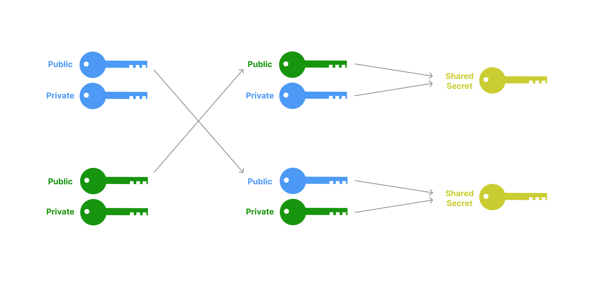

_This article was originally published on [phantom.app](https://phantom.app/blog/the-complete-guide-to-phantom-deeplinks)._

## Introduction

Solana’s fast and cheap transactions make it the perfect testing ground for novel mobile applications. Until recently, however, there was no way for native mobile applications to interact with existing Solana wallets. In order to connect to users, Solana dapps had to be web-based. In a mobile context, these web dapps were most often viewed within a wallet’s in-app browser.

All of this changed in Phantom `v22.04.01` with the release of Phantom **deeplinks**. With deeplinks, iOS and Android apps can now interact directly with the Phantom mobile app to connect, sign, and send transactions. In this tutorial, we’ll walk through how you can integrate Phantom deeplinks into your Solana dapp.

## What are deeplinks?

If you've ever created a link using an HTML `<a>` tag, you're probably familiar with the `mailto:` scheme. Unlike a normal url that directs users straight to a website (i.e. `href="<https://google.com>"`), the `mailto:` scheme tells the operating system that it should instead open the email application. Once open, your email app can then parse the url to present a rich user experience. For example, the url `href="mailto:brian@phantom.app?subject=Deeplinking Tutorial Feedback&body=Hi Brian,"` will <a href="mailto:brian@phantom.app?subject=Deeplinking Tutorial Feedback&body=Hi Brian,">compose an email to me</a> with both a subject and body already pre-configured. These url schemes are often referred to as [deeplinks](https://en.wikipedia.org/wiki/Mobile_deep_linking).

Just like using the `mailto:` scheme, other applications can also link to each other by using their own custom url schemes. When developing a mobile application, we can specify our own protocol handler (such as: `discord://` or `phantom://`) and create deeplinks that tell the operating system to open our native app.

We can even take it a step further: using a concept known as [universal links](https://developer.apple.com/ios/universal-links/), we can create deeplinks based on regular `https://` links for a domain that we control. This comes with the added benefits of being more secure, as well as a better user experience in cases where users have yet to install our app.

Phantom supports both universal links (e.g. `https://phantom.app/ul/<version>/<method>`) as well as a custom protocol handler (`phantom://<version>/<method>`). For the remainder of this tutorial, we'll focus on Phantom's universal links and refer to these collectively as **deeplinks**.

## What we're building

To showcase the power of Phantom deeplinks, we'll be creating a mobile app that can interact with a program (aka smart contract) on Solana. Specifically, we’re going to be building a mobile-version of the movie reviews dapp from [module 1 of the Solana Development Course](https://github.com/Unboxed-Software/solana-course/blob/main/README.md#module-1---client-interaction-with-the-solana-network).

For the purposes of this tutorial, we won’t be writing any Solana programs ourselves. The Solana Development Course already does a great job of teaching this! Instead, we’ll be writing a mobile app that interacts with the [course’s program](https://solscan.io/account/CenYq6bDRB7p73EjsPEpiYN7uveyPUTdXkDkgUduboaN?cluster=devnet) that’s already deployed to devnet. Once complete, our app will let users sign-in and send reviews using Phantom. All in all, it'll look a little something like this:

`youtube: [Full Flow](https://www.youtube.com/watch?v=tiYizz9h3YE)`

We'll be building this app with [React Native](https://reactnative.dev/) and [Expo CLI](https://docs.expo.dev/workflow/expo-cli/). If you're new to mobile development, Expo makes it easy to get started within minutes. The majority of code we’ll be writing will be indistinguishable from standard [React](https://reactjs.org/) and [TypeScript](https://www.typescriptlang.org/). An added benefit of using Expo with React Native is that our app will be ready to use across both iOS and Android devices.

## Overview

This tutorial covers 3 main sections:

- [Creating our mobile app using React Native and Expo CLI](https://www.notion.so/The-Complete-Guide-to-Phantom-Deeplinks-f7d0f1ea59a9420eb32a53560cf1bfc5)
- [Connecting our app to Phantom](https://www.notion.so/The-Complete-Guide-to-Phantom-Deeplinks-f7d0f1ea59a9420eb32a53560cf1bfc5)
- [Signing and sending transactions via Phantom](https://www.notion.so/The-Complete-Guide-to-Phantom-Deeplinks-f7d0f1ea59a9420eb32a53560cf1bfc5)

## Creating our mobile app using React Native and Expo CLI

### Prerequisites

Before we can build anything, we first need to install the necessary command-line tools. Chief amongst these are [Node.js](https://nodejs.org/en/) and [Expo CLI](https://docs.expo.dev/workflow/expo-cli/#installation). If you don’t have Node yet, I recommend installing it via [Node Version Manager (NVM)](https://github.com/nvm-sh/nvm).

Before proceeding, you should be able to run the following commands in your terminal. I developed mine with the following versions:

```bash
node -v
# output: v16.15.0
expo-cli --version
# output: 5.5.1
```

In addition to our laptop’s development environment, we’ll also want a phone to test our React Native app. One of the many benefits of Expo is that it makes it easy to test your app on a physical device throughout the development process. Before proceeding, make sure to install both the [Expo](https://docs.expo.dev/guides/testing-on-devices/) and [Phantom](https://phantom.app/download) mobile apps from your phone’s official app store.

### Scaffolding our React Native app

With the necessary tools installed, we can get started with our app. To recap: we’re going to be building a mobile app for the movie reviews program in the [Solana Development Course](https://github.com/Unboxed-Software/solana-course/blob/main/README.md#module-1---client-interaction-with-the-solana-network). Instead of rehashing the lessons from that course, I’ve added the necessary components to a starter repo located on our [GitHub](https://github.com/phantom-labs/deep-links-movie-tutorial.git). To get started, simply fork the repo and clone it to your local developer environment:

```bash
git clone -b starter https://github.com/phantom-labs/deep-links-movie-tutorial.git
```

Then, change into the project directory and install the necessary dependencies:

```bash
cd deep-links-movie-tutorial
yarn
```

Once you’ve installed the dependencies, you can fire up the app with:

```bash
yarn start
```

From here, your terminal should present you with a large QR code. Go ahead and grab your phone, open the camera app, and scan the QR code that is present on your laptop’s terminal. If you’re using an Android phone, you may need to scan it from within the Expo mobile app. If all goes well, your code should begin bundling and your phone will open the mobile app from the video above.

Go ahead and try scrolling and searching within the app. If you’ve already completed the Solana Development Course’s module on [Deserializing Custom Account Data](https://github.com/Unboxed-Software/solana-course/blob/main/content/deserialize-custom-data.md), then this should look pretty familiar. Here, our app is fetching reviews from the [course’s program](https://solscan.io/account/CenYq6bDRB7p73EjsPEpiYN7uveyPUTdXkDkgUduboaN?cluster=devnet) and then paginating and filtering the results based on how far you scroll or what you search. If you take a look at our starter repo, you’ll see that the `MovieList.tsx` and `MovieCoordinator.ts` components from the course have already been integrated into our React Native app under the `components` directory. For the purposes of this tutorial, we won’t be going into detail over how these are working under the hood. If you’re interested in learning more, the [Solana Development Course](https://github.com/Unboxed-Software/solana-course/blob/main/README.md#module-1---client-interaction-with-the-solana-network) already does a great job teaching how all this works!

After playing around with our app, we can see that we’re already reading and displaying movies reviews that are stored on Solana. How would we go about adding new reviews? If you were to tap on the “Connect Phantom” button, you’ll see that nothing happens. Let’s see what’s going on by opening up the `App.tsx` file at the root of directory:

```tsx
import "react-native-get-random-values"
import "react-native-url-polyfill/auto"
import { Buffer } from "buffer"
global.Buffer = global.Buffer || Buffer
import { StatusBar } from "expo-status-bar"
import React, { useRef, useState } from "react"
import { ActivityIndicator, StyleSheet, Text, View } from "react-native"
import {
  clusterApiUrl,
  Connection,
  PublicKey,
  Transaction,
} from "@solana/web3.js"
import MovieList from "./components/MovieList"
import Button from "./components/Button"
import { SafeAreaProvider, SafeAreaView } from "react-native-safe-area-context"
import ActionSheet from "react-native-actions-sheet"
import AddReviewSheet from "./components/AddReviewSheet"
import Toast from "react-native-toast-message"
import { toastConfig } from "./components/ToastConfig"
import { COLORS } from "./constants"
import * as Linking from "expo-linking"

const connection = new Connection(clusterApiUrl("devnet"))

export default function App() {
  const [phantomWalletPublicKey, setPhantomWalletPublicKey] =
    useState<PublicKey | null>(null)

  const [submitting, setSubmitting] = useState(false)

  const actionSheetRef = useRef<ActionSheet>(null)

  // Initiate a new connection to Phantom
  const connect = async () => {}

  // Initiate a disconnect from Phantom
  const disconnect = async () => {}

  // Initiate a new transaction via Phantom. We call this in `components/AddReviewSheet.tsx` to send our movie review to the Solana network
  const signAndSendTransaction = async (transaction: Transaction) => {}

  // Open the 'Add a Review' sheet defined in `components/AddReviewSheet.tsx`
  const openAddReviewSheet = () => {
    actionSheetRef.current?.show()
  }

  return (
    <SafeAreaProvider>
      <SafeAreaView style={styles.container}>
        <View style={styles.header}>
          {phantomWalletPublicKey ? (
            <>
              <View style={[styles.row, styles.wallet]}>
                <View style={styles.greenDot} />
                <Text
                  style={styles.text}
                  numberOfLines={1}
                  ellipsizeMode="middle"
                >
                  {`Connected to: ${phantomWalletPublicKey.toString()}`}
                </Text>
              </View>
              <View style={styles.row}>
                <Button title="Add Review" onPress={openAddReviewSheet} />
                <Button title="Disconnect" onPress={disconnect} />
              </View>
            </>
          ) : (
            <View style={{ marginTop: 15 }}>
              <Button title="Connect Phantom" onPress={connect} />
            </View>
          )}
        </View>
        {submitting && (
          <ActivityIndicator
            color={COLORS.WHITE}
            size="large"
            style={styles.spinner}
          />
        )}
        <MovieList connection={connection} />
        <AddReviewSheet
          actionSheetRef={actionSheetRef}
          phantomWalletPublicKey={phantomWalletPublicKey}
          signAndSendTransaction={signAndSendTransaction}
        />
        <Toast config={toastConfig} />
        <StatusBar style="auto" />
      </SafeAreaView>
    </SafeAreaProvider>
  )
}

const styles = StyleSheet.create({
  container: {
    flex: 1,
    backgroundColor: COLORS.DARK_GREY,
    flexGrow: 1,
    position: "relative",
  },
  greenDot: {
    height: 8,
    width: 8,
    borderRadius: 10,
    marginRight: 5,
    backgroundColor: COLORS.GREEN,
  },
  header: {
    width: "95%",
    marginLeft: "auto",
    marginRight: "auto",
  },
  row: {
    flexDirection: "row",
    justifyContent: "space-between",
    marginBottom: 5,
  },
  spinner: {
    position: "absolute",
    alignSelf: "center",
    top: "50%",
    zIndex: 1000,
  },
  text: {
    color: COLORS.LIGHT_GREY,
    width: "100%",
  },
  wallet: {
    alignItems: "center",
    margin: 10,
    marginBottom: 15,
  },
})
```

We’ll be focusing mostly on this file for the majority of our walkthrough. Looking at our `App.tsx` component, you can see right off the bat that our app is looking to store a `phantomWalletPublicKey`. If we look down at what is returned from this component, you’ll see that if this `phantomWalletPublicKey` exists, we’ll render a button that let’s us add a new movie review. Otherwise, we’ll return a “Connect Phantom” button:

```tsx
{
  phantomWalletPublicKey ? (
    <>
      <View style={[styles.row, styles.wallet]}>
        <View style={styles.greenDot} />
        <Text style={styles.text} numberOfLines={1} ellipsizeMode="middle">
          {`Connected to: ${phantomWalletPublicKey.toString()}`}
        </Text>
      </View>
      <View style={styles.row}>
        <Button title="Add Review" onPress={openAddReviewSheet} />
        <Button title="Disconnect" onPress={disconnect} />
      </View>
    </>
  ) : (
    <View style={{ marginTop: 15 }}>
      <Button title="Connect Phantom" onPress={connect} />
    </View>
  )
}
```

We can also see that our `connect` function is currently lacking functionality:

```tsx
// Initiate a new connection to Phantom
const connect = async () => {
  console.log("connect")
}
```

Let’s go ahead and change that!

## Connecting our app to Phantom

When we first introduced the concept of deeplinking, we compared it to clicking on a `mailto:` link. In React Native, however, there are no `<a>` tags for us to work with. Instead, we can use the [expo-linking](https://docs.expo.dev/versions/latest/sdk/linking/) package to create and open URLs from within our app.

Let’s use this package to try and connect to Phantom from within our `connect` function. Taking a look at [Phantom’s documentation](https://docs.phantom.app/integrating/deeplinks-ios-and-android/provider-methods/connect), we can see that the URL needed to deeplink into Phantom’s connect method is: [`https://phantom.app/ul/v1/connect`](https://phantom.app/ul/v1/connect). Let’s try a naive approach by replacing our `connect` method with the following:

```tsx
// Initiate a new connection to Phantom
const connect = async () => {
  const url = "https://phantom.app/ul/v1/connect"
  Linking.openURL(url)
}
```

Turning back to our phone, let’s try tapping on our “Connect Phantom” button again. This time, we should instantly teleport over to our Phantom app. Pretty cool!

`video: https://www.youtube.com/watch?v=P_T0Kgzlunc`

While our `connect` deeplink jumped us over to the Phantom app, it didn’t quite work as expected. When we opened Phantom, we were never prompted with a connection request. If we switch back over to our dapp, it appears as if nothing had happened.

Taking another look at the Phantom documentation, it’s clear that our connection request requires us to specify four [additional parameters](https://docs.phantom.app/integrating/deeplinks-ios-and-android/provider-methods/connect#query-string-parameters):

- `app_url` : A URL used to fetch app metadata (i.e. title, icon) using the same properties found in [Displaying Your App](notion://www.notion.so/best-practices/displaying-your-app).
- `dapp_encryption_public_key` : A public key used for end-to-end encryption.
- `redirect_link` : The URI where Phantom should redirect the user upon connection.
- `cluster` : The network that should be used for subsequent interactions.

The `app_url` and `cluster` are both straightforward. For the `app_url`, we just need to pass a URL that represents our app. I created a dummy site at [`https://deeplink-movie-tutorial-dummy-site.vercel.app/`](https://deeplink-movie-tutorial-dummy-site.vercel.app/), but feel free to add your own website here. When it comes to selecting a `cluster`, we’ll want to specify `devnet`. This is because the program we are interacting with has already been deployed on devnet.

```tsx
// Initiate a new connection to Phantom
const connect = async () => {
  // TODO
  const params = {
    cluster: "devnet",
    app_url: "https://deeplink-movie-tutorial-dummy-site.vercel.app/",
  }

  const url = "https://phantom.app/ul/v1/connect"
  Linking.openURL(url)
}
```

Before we dive deeper into how we can configure a proper connection request, let’s take a minute to switch our wallet’s network over to `devnet`. We’ll need this to connect and sign `devnet` requests coming from our app. You can change this within Phantom’s settings by following the steps in this video:

`video: https://www.youtube.com/watch?v=3h51s4igs-o`

Turning back to our developer environment, the last two parameters we have to specify are `dapp_encryption_public_key` and `redirect_link`. We will need both of these not only for our `connect` request, but also for all subsequent requests to Phantom. Let’s look at what each of these entails.

### Handling Encryption

When using deeplinks, all communication between our app and Phantom will be encrypted by default. We can achieve this encryption via a simple key exchange known as [Diffie-Hellman](https://en.wikipedia.org/wiki/Diffie%E2%80%93Hellman_key_exchange).

In the same way that a Phantom user has a **keypair** made of up a **public key** (i.e. their Solana address) and a **private key** (managed by Phantom), our app will create its own keypair specific to its connection with Phantom. Under the Diffie-Hellman exchange, our app will then share its public key in the initial `connect` request to Phantom. Once it receives our public key, Phantom will then generate its own keypair that’s unique to our app. When sending a `connect` response back to our app, Phantom will also share its corresponding public key with our app.

Once both parties have each other’s public keys, they can combine them with their own private keys that they **_did not_** share and end up with the same result. The beauty of this process is that while neither party shared any sensitive information (both only shared public keys), they can now reliably create the same secret that can be used for encrypting messages. We’ll refer to this secret as the **shared secret.**



To begin implementing Diffie-Hellman, we’ll need a way of generating a x25519 keypair. We recommend using [TweetNaCl](https://tweetnacl.js.org/#/) which is already installed with our starter repo. In addition to importing TweetNaCl, we’ll need to keep track of the public key we generate as well as the shared secret we’ll get when Phantom sends us a response. When we send our public key as a `dapp_encryption_public_key` parameter, we’ll also need to encode with with `bs58`. Let’s update our `App.tsx` file with the following:

```tsx
import "react-native-get-random-values"
import "react-native-url-polyfill/auto"
import { Buffer } from "buffer"
global.Buffer = global.Buffer || Buffer
import { StatusBar } from "expo-status-bar"
import React, { useRef, useState } from "react"
import { ActivityIndicator, StyleSheet, Text, View } from "react-native"
import {
  clusterApiUrl,
  Connection,
  PublicKey,
  Transaction,
} from "@solana/web3.js"
import MovieList from "./components/MovieList"
import Button from "./components/Button"
import { SafeAreaProvider, SafeAreaView } from "react-native-safe-area-context"
import ActionSheet from "react-native-actions-sheet"
import AddReviewSheet from "./components/AddReviewSheet"
import Toast from "react-native-toast-message"
import { toastConfig } from "./components/ToastConfig"
import { COLORS } from "./constants"
import * as Linking from "expo-linking"
import nacl from "tweetnacl"
import bs58 from "bs58"

const connection = new Connection(clusterApiUrl("devnet"))

export default function App() {
  const [phantomWalletPublicKey, setPhantomWalletPublicKey] =
    useState<PublicKey | null>(null)

  const [submitting, setSubmitting] = useState(false)

  const actionSheetRef = useRef<ActionSheet>(null)

  const [dappKeyPair] = useState(nacl.box.keyPair())
  const [sharedSecret, setSharedSecret] = useState<Uint8Array>()

  // Initiate a new connection to Phantom
  const connect = async () => {
    // TODO
    const params = {
      cluster: "devnet",
      app_url: "https://deeplink-movie-tutorial-dummy-site.vercel.app/",
      dapp_encryption_public_key: bs58.encode(dappKeyPair.publicKey),
    }

    const url = "https://phantom.app/ul/v1/connect"
    Linking.openURL(url)
  }

  // Initiate a disconnect from Phantom
  const disconnect = async () => {
    console.log("disconnect")
  }

  // Initiate a new transaction via Phantom. We call this in `components/AddReviewSheet.tsx` to send our movie review to the Solana network
  const signAndSendTransaction = async (transaction: Transaction) => {
    console.log("signAndSendTransaction")
  }

  // Open the 'Add a Review' sheet defined in `components/AddReviewSheet.tsx`
  const openAddReviewSheet = () => {
    actionSheetRef.current?.show()
  }

  return (
    <SafeAreaProvider>
      <SafeAreaView style={styles.container}>
        <View style={styles.header}>
          {phantomWalletPublicKey ? (
            <>
              <View style={[styles.row, styles.wallet]}>
                <View style={styles.greenDot} />
                <Text
                  style={styles.text}
                  numberOfLines={1}
                  ellipsizeMode="middle"
                >
                  {`Connected to: ${phantomWalletPublicKey.toString()}`}
                </Text>
              </View>
              <View style={styles.row}>
                <Button title="Add Review" onPress={openAddReviewSheet} />
                <Button title="Disconnect" onPress={disconnect} />
              </View>
            </>
          ) : (
            <View style={{ marginTop: 15 }}>
              <Button title="Connect Phantom" onPress={connect} />
            </View>
          )}
        </View>
        {submitting && (
          <ActivityIndicator
            color={COLORS.WHITE}
            size="large"
            style={styles.spinner}
          />
        )}
        <MovieList connection={connection} />
        <AddReviewSheet
          actionSheetRef={actionSheetRef}
          phantomWalletPublicKey={phantomWalletPublicKey}
          signAndSendTransaction={signAndSendTransaction}
        />
        <Toast config={toastConfig} />
        <StatusBar style="auto" />
      </SafeAreaView>
    </SafeAreaProvider>
  )
}

const styles = StyleSheet.create({
  container: {
    flex: 1,
    backgroundColor: COLORS.DARK_GREY,
    flexGrow: 1,
    position: "relative",
  },
  greenDot: {
    height: 8,
    width: 8,
    borderRadius: 10,
    marginRight: 5,
    backgroundColor: COLORS.GREEN,
  },
  header: {
    width: "95%",
    marginLeft: "auto",
    marginRight: "auto",
  },
  row: {
    flexDirection: "row",
    justifyContent: "space-between",
    marginBottom: 5,
  },
  spinner: {
    position: "absolute",
    alignSelf: "center",
    top: "50%",
    zIndex: 1000,
  },
  text: {
    color: COLORS.LIGHT_GREY,
    width: "100%",
  },
  wallet: {
    alignItems: "center",
    margin: 10,
    marginBottom: 15,
  },
})
```

Before we can get to using our `dapp_encryption_public_key`, we’ll need to set up some way of handling a response from Phantom. Let’s go ahead and set that up now.

### Specifying Redirects

Whenever we make a deeplinking request to Phantom, we’ll also need to tell Phantom how to get back to our app. We can do this by creating our own set of deeplinks for our React Native app. Specifically, we can create a deeplink for receiving a Phantom `connect` event and include that as the `redirect_link` in our initial request.

Once again, the [expo-linking](https://docs.expo.dev/versions/latest/sdk/linking/) package can help us achieve this. First, we’ll need to specify our own app’s [URL scheme](https://docs.expo.dev/guides/linking/#linking-to-your-app), just like how Phantom specifies `phantom://`. We can do this from within our `app.json` file. Here, I’ve already set us up with `deep-links-movie-tutorial://`. Next, we’ll need to create the URL endpoint we want to pass as our `redirect_link`. Let’s call this `onConnect`. We can create this URL from within `App.tsx` like so:

```tsx
const onConnectRedirectLink = Linking.createURL("onConnect")
```

Now that we have a valid URL that Phantom can redirect back to, we’ll need a way for our app to actually listen for in-bound links. There are [two scenarios](https://reactnative.dev/docs/linking#handling-deep-links) in which our app could be opened with this link.

1. **Our app is already already opened and a Linking URL event is fired**
2. **Our app is not already opened and a URL is passed which opens our app and sets it as our app’s `initialURL`**

In the first case, because our app is already open and running, we can simply listen for a `url` event and track the incoming URL:

```tsx
const [deepLink, setDeepLink] = useState<string>("")

// On app start up, listen for a "url" event
useEffect(() => {
  Linking.addEventListener("url", handleDeepLink)
  return () => {
    Linking.removeEventListener("url", handleDeepLink)
  }
}, [])

// When a "url" event occurs, track the url
const handleDeepLink = ({ url }: Linking.EventType) => {
  setDeepLink(url)
}
```

In the second scenario, we can’t rely on just listening for the event because our app may not already be open when the event is fired. To account for this, we should make sure we always call [Linking.getInitialURL](https://docs.expo.dev/versions/latest/sdk/linking/#linkinggetinitialurl) on our app startup:

```tsx
const [deepLink, setDeepLink] = useState<string>("")

// On app start up, check if we were opened by an inbound deeplink. If so, track the intial URL
// Then, listen for a "url" event
useEffect(() => {
  const initializeDeeplinks = async () => {
    const initialUrl = await Linking.getInitialURL()
    if (initialUrl) {
      setDeepLink(initialUrl)
    }
  }
  initializeDeeplinks()
  const listener = Linking.addEventListener("url", handleDeepLink)
  return () => {
    listener.remove()
  }
}, [])

// When a "url" event occurs, track the url
const handleDeepLink = ({ url }: Linking.EventType) => {
  setDeepLink(url)
}
```

Finally, we’ll need some way of actually parsing the inbound link from Phantom and responding to it accordingly. Whenever we receive a `deeplink` that matches the `onConnect` URL we specified earlier, we know we’ll be dealing with a `connect` response. We can handle this like so:

```tsx
// Handle in-bound links
useEffect(() => {
  if (!deepLink) return

  const url = new URL(deepLink)
  const params = url.searchParams

  // Handle an error response from Phantom
  if (params.get("errorCode")) {
    const error = Object.fromEntries([...params])
    const message =
      error?.errorMessage ??
      JSON.stringify(Object.fromEntries([...params]), null, 2)
    console.log("error: ", message)
    return
  }

  // Handle a `connect` response from Phantom
  if (/onConnect/.test(url.pathname)) {
    console.log("we received a connect response from Phantom: ", url)
  }
}, [deepLink])
```

### Making a proper request to Phantom

Now that we have all of the necessary components, it’s time for us to make a proper `connect` request to Phantom. To recap, our connect request requires four parameters:

- `app_url`
- `dapp_encryption_public_key`
- `redirect_link`
- `cluster`

When interacting with deeplinks, we can specify additional parameters by simply appending them to the base URL as query string parameters. Let’s put all these pieces together and try making a new connect request. Go ahead and update your `App.tsx` file with the following:

```tsx
import "react-native-get-random-values"
import "react-native-url-polyfill/auto"
import { Buffer } from "buffer"
global.Buffer = global.Buffer || Buffer
import { StatusBar } from "expo-status-bar"
import React, { useEffect, useRef, useState } from "react"
import { ActivityIndicator, StyleSheet, Text, View } from "react-native"
import {
  clusterApiUrl,
  Connection,
  PublicKey,
  Transaction,
} from "@solana/web3.js"
import MovieList from "./components/MovieList"
import Button from "./components/Button"
import { SafeAreaProvider, SafeAreaView } from "react-native-safe-area-context"
import ActionSheet from "react-native-actions-sheet"
import AddReviewSheet from "./components/AddReviewSheet"
import Toast from "react-native-toast-message"
import { toastConfig } from "./components/ToastConfig"
import { COLORS } from "./constants"
import nacl from "tweetnacl"
import bs58 from "bs58"
import * as Linking from "expo-linking"

const onConnectRedirectLink = Linking.createURL("onConnect")

const connection = new Connection(clusterApiUrl("devnet"))

export default function App() {
  const [phantomWalletPublicKey, setPhantomWalletPublicKey] =
    useState<PublicKey | null>(null)

  const [submitting, setSubmitting] = useState(false)

  const actionSheetRef = useRef<ActionSheet>(null)

  const [dappKeyPair] = useState(nacl.box.keyPair())
  const [sharedSecret, setSharedSecret] = useState<Uint8Array>()

  const [deepLink, setDeepLink] = useState<string>("")

  // On app start up, check if we were opened by an inbound deeplink. If so, track the intial URL
  // Then, listen for a "url" event
  useEffect(() => {
    const initializeDeeplinks = async () => {
      const initialUrl = await Linking.getInitialURL()
      if (initialUrl) {
        setDeepLink(initialUrl)
      }
    }
    initializeDeeplinks()
    const listener = Linking.addEventListener("url", handleDeepLink)
    return () => {
      listener.remove()
    }
  }, [])

  // When a "url" event occurs, track the url
  const handleDeepLink = ({ url }: Linking.EventType) => {
    setDeepLink(url)
  }

  // Handle in-bound links
  useEffect(() => {
    if (!deepLink) return

    const url = new URL(deepLink)
    const params = url.searchParams

    // Handle an error response from Phantom
    if (params.get("errorCode")) {
      const error = Object.fromEntries([...params])
      const message =
        error?.errorMessage ??
        JSON.stringify(Object.fromEntries([...params]), null, 2)
      console.log("error: ", message)
      return
    }

    // Handle a `connect` response from Phantom
    if (/onConnect/.test(url.pathname)) {
      console.log("we received a connect response from Phantom: ", url)
    }
  }, [deepLink])

  // Initiate a new connection to Phantom
  const connect = async () => {
    const params = new URLSearchParams({
      dapp_encryption_public_key: bs58.encode(dappKeyPair.publicKey),
      cluster: "devnet",
      app_url: "https://phantom.app",
      redirect_link: onConnectRedirectLink,
    })

    const url = `https://phantom.app/ul/v1/connect?${params.toString()}`
    Linking.openURL(url)
  }

  // Initiate a disconnect from Phantom
  const disconnect = async () => {
    console.log("disconnect")
  }

  // Initiate a new transaction via Phantom. We call this in `components/AddReviewSheet.tsx` to send our movie review to the Solana network
  const signAndSendTransaction = async (transaction: Transaction) => {
    console.log("signAndSendTransaction")
  }

  // Open the 'Add a Review' sheet defined in `components/AddReviewSheet.tsx`
  const openAddReviewSheet = () => {
    actionSheetRef.current?.show()
  }

  return (
    <SafeAreaProvider>
      <SafeAreaView style={styles.container}>
        <View style={styles.header}>
          {phantomWalletPublicKey ? (
            <>
              <View style={[styles.row, styles.wallet]}>
                <View style={styles.greenDot} />
                <Text
                  style={styles.text}
                  numberOfLines={1}
                  ellipsizeMode="middle"
                >
                  {`Connected to: ${phantomWalletPublicKey.toString()}`}
                </Text>
              </View>
              <View style={styles.row}>
                <Button title="Add Review" onPress={openAddReviewSheet} />
                <Button title="Disconnect" onPress={disconnect} />
              </View>
            </>
          ) : (
            <View style={{ marginTop: 15 }}>
              <Button title="Connect Phantom" onPress={connect} />
            </View>
          )}
        </View>
        {submitting && (
          <ActivityIndicator
            color={COLORS.WHITE}
            size="large"
            style={styles.spinner}
          />
        )}
        <MovieList connection={connection} />
        <AddReviewSheet
          actionSheetRef={actionSheetRef}
          phantomWalletPublicKey={phantomWalletPublicKey}
          signAndSendTransaction={signAndSendTransaction}
        />
        <Toast config={toastConfig} />
        <StatusBar style="auto" />
      </SafeAreaView>
    </SafeAreaProvider>
  )
}

const styles = StyleSheet.create({
  container: {
    flex: 1,
    backgroundColor: COLORS.DARK_GREY,
    flexGrow: 1,
    position: "relative",
  },
  greenDot: {
    height: 8,
    width: 8,
    borderRadius: 10,
    marginRight: 5,
    backgroundColor: COLORS.GREEN,
  },
  header: {
    width: "95%",
    marginLeft: "auto",
    marginRight: "auto",
  },
  row: {
    flexDirection: "row",
    justifyContent: "space-between",
    marginBottom: 5,
  },
  spinner: {
    position: "absolute",
    alignSelf: "center",
    top: "50%",
    zIndex: 1000,
  },
  text: {
    color: COLORS.LIGHT_GREY,
    width: "100%",
  },
  wallet: {
    alignItems: "center",
    margin: 10,
    marginBottom: 15,
  },
})
```

Now, when we tap our “Connect Phantom” button, we should also see a connect modal pop up from within Phantom. When we approve this request by tapping “Connect”, Phantom should then redirect us back to our app. Progress!

`video: https://www.youtube.com/watch?v=4cN0eL36yjE`

### Putting it all together

Let’s take a look at our console to see what Phantom is sending back to our app. If you take a look your console, you should see that we’re logging a URL that looks something like this:

```tsx
"exp://172.20.10.2:19000/--/onConnect?phantom_encryption_public_key=AHWZNYZ7Q3wsnugvYSmSLfupcRHvAJqDRWkHwwBBm5jh&nonce=2n76Ujnsi6u5i3NM1xC4HE6m6WuMyX3L2&data=FspPVemQN61nddg5DhyftJYcycsNQrvUpnSQi6DxtgmpvMh82bDUrE3itP5LSCJmqKgbQdYU3M5N5duM6HMrvesC2pyMdDmAJtGawo9wjWqxG6F1VUAg5dndAqVHN1XWsDhuBjsJYRL1DMFMSgb6PveeV6tJ3joxjGMi4ZrjFGxXFakGUWRKsQzgd44w28B4yJH1n9Eiwp8rPLwi4BaWwtuMzjUX42UwmVyEbeCEZrJ3rJQZfuTYEULWo5RPnDZDKssnR4nLY4nfYjk27iSG3ooDX5C4SoCvvZLbMd7jXtR6hhwWfzdYUM66fsjbN9WPaVDvxVBDmVSjwJBsM1HQv1GfKf981eD9aeZJptVA6yJjxTHYoVyQJd8WMqPJrhjZUJHbhPwfc9qLiKhXvpECSwGyKfGxLuqW5kK"
```

Recall that when we made our `connect` request to Phantom, we passed additional data such as our `app_url` and `dapp_encryption_public_key` as query string parameters. Now that we have a response, we can see that the URL we’re logging from Phantom also has additional data at the following query string parameters:

- `phantom_encryption_public_key`
- `nonce`
- `data`

Taking a closer look at these query string parameters, you’ll see now that all data from Phantom has been encrypted. In particular, the `data` field sent back from Phantom is now an encrypted JSON string. Let’s go ahead and decrypt it!

When we made our `connect` request to Phantom, we passed along our `dapp_encryption_public_key` that Phantom could use to generate a shared secret on its side. Now that Phantom has passed us back its `phantom_encryption_public_key`, we can also generate this shared secret and complete the Diffie-Hellman key exchange needed to decrypt the `data`. We can do this by decoding the `phantom_encryption_public_key` received from Phantom and combining it with our app’s `dappKeyPair.secretKey` like so:

```tsx
// Handle a `connect` response from Phantom
if (/onConnect/.test(url.pathname)) {
  console.log("we received a connect response from Phantom: ", url)
  const sharedSecretDapp = nacl.box.before(
    bs58.decode(params.get("phantom_encryption_public_key")!),
    dappKeyPair.secretKey
  )
}
```

Moving over to our `utils` folder, let’s create a new file named `decryptPayload.ts` and add the following function:

```tsx
import nacl from "tweetnacl"
import bs58 from "bs58"

export const decryptPayload = (
  data: string,
  nonce: string,
  sharedSecret?: Uint8Array
) => {
  if (!sharedSecret) throw new Error("missing shared secret")

  const decryptedData = nacl.box.open.after(
    bs58.decode(data),
    bs58.decode(nonce),
    sharedSecret
  )
  if (!decryptedData) {
    throw new Error("Unable to decrypt data")
  }
  return JSON.parse(Buffer.from(decryptedData).toString("utf8"))
}
```

Here, we’re creating a helper function that will decrypt a given `data` string using the `sharedSecret` we just generated in our Diffie-Hellman key exchange and the `nonce` passed back from Phantom. With this method now in place, we can now decrypt the `data` passed back from Phantom:

```tsx
// Handle a `connect` response from Phantom
if (/onConnect/.test(url.pathname)) {
  console.log("we received a connect response from Phantom: ", url)
  const sharedSecretDapp = nacl.box.before(
    bs58.decode(params.get("phantom_encryption_public_key")!),
    dappKeyPair.secretKey
  )
  const connectData = decryptPayload(
    params.get("data")!,
    params.get("nonce")!,
    sharedSecretDapp
  )
  console.log("decrypted data received from Phantom: ", connectData)
}
```

Taking a look at our console, we should see that our app has decoded the `data` from Phantom to an object that has `public_key` and `session` fields:

```tsx
decrypted data received from Phantom:  Object {
  "public_key": "GYLkraPfvT3UtUbdxcHiVWV2EShBoZtqW1Bcq4VazUCt",
  "session": "22XD6EDJ4X3ALDJkHkQrdmrFdTHVHjD2noCbPrPum7xr9x5cbLN9XS5MtiVtNF5tCUFAY6XyBmyvyLatcCrzpGCGJ6kFFwYf4jKkG3YnYJYZDbTaEFPraADF2U56gtXq14ZMu7YTSA3Uge8sV51Qhs5HSv2UvP4wsdsDDhNXZJB7jUcbY4LgE6sfdP2UEEwvYxf91dmMQgEc3BwFD8ab59Lssi",
}
```

Here, the `public_key` that Phantom passes us is the public key of the end user. The `session` we receive is specific to this user and represents our user’s connection to our app. Our app should continue to pass this `session` param back to Phantom to authenticate all subsequent requests. As long as this `session` is valid, we should consider this user “connected” to our app.

With this data now decrypted, we can go ahead and store both the `public_key` and `session` received from Phantom. Let’s update our `App.tsx` file with the following:

```tsx
import "react-native-get-random-values"
import "react-native-url-polyfill/auto"
import { Buffer } from "buffer"
global.Buffer = global.Buffer || Buffer
import { StatusBar } from "expo-status-bar"
import React, { useEffect, useRef, useState } from "react"
import { ActivityIndicator, StyleSheet, Text, View } from "react-native"
import {
  clusterApiUrl,
  Connection,
  PublicKey,
  Transaction,
} from "@solana/web3.js"
import MovieList from "./components/MovieList"
import Button from "./components/Button"
import { SafeAreaProvider, SafeAreaView } from "react-native-safe-area-context"
import ActionSheet from "react-native-actions-sheet"
import AddReviewSheet from "./components/AddReviewSheet"
import Toast from "react-native-toast-message"
import { toastConfig } from "./components/ToastConfig"
import { COLORS } from "./constants"
import * as Linking from "expo-linking"
import nacl from "tweetnacl"
import bs58 from "bs58"
import { decryptPayload } from "./utils/decryptPayload"

const onConnectRedirectLink = Linking.createURL("onConnect")

const connection = new Connection(clusterApiUrl("devnet"))

export default function App() {
  const [phantomWalletPublicKey, setPhantomWalletPublicKey] =
    useState<PublicKey | null>(null)

  const [submitting, setSubmitting] = useState(false)

  const actionSheetRef = useRef<ActionSheet>(null)

  const [dappKeyPair] = useState(nacl.box.keyPair())
  const [sharedSecret, setSharedSecret] = useState<Uint8Array>()
  const [session, setSession] = useState<string>()

  const [deepLink, setDeepLink] = useState<string>("")

  // On app start up, check if we were opened by an inbound deeplink. If so, track the intial URL
  // Then, listen for a "url" event
  useEffect(() => {
    const initializeDeeplinks = async () => {
      const initialUrl = await Linking.getInitialURL()
      if (initialUrl) {
        setDeepLink(initialUrl)
      }
    }
    initializeDeeplinks()
    const listener = Linking.addEventListener("url", handleDeepLink)
    return () => {
      listener.remove()
    }
  }, [])

  // When a "url" event occurs, track the url
  const handleDeepLink = ({ url }: Linking.EventType) => {
    setDeepLink(url)
  }

  // Handle in-bound links
  useEffect(() => {
    if (!deepLink) return

    const url = new URL(deepLink)
    const params = url.searchParams

    // Handle an error response from Phantom
    if (params.get("errorCode")) {
      const error = Object.fromEntries([...params])
      const message =
        error?.errorMessage ??
        JSON.stringify(Object.fromEntries([...params]), null, 2)
      console.log("error: ", message)
      return
    }

    // Handle a `connect` response from Phantom
    if (/onConnect/.test(url.pathname)) {
      const sharedSecretDapp = nacl.box.before(
        bs58.decode(params.get("phantom_encryption_public_key")!),
        dappKeyPair.secretKey
      )
      const connectData = decryptPayload(
        params.get("data")!,
        params.get("nonce")!,
        sharedSecretDapp
      )
      setSharedSecret(sharedSecretDapp)
      setSession(connectData.session)
      setPhantomWalletPublicKey(new PublicKey(connectData.public_key))
      console.log(`connected to ${connectData.public_key.toString()}`)
    }
  }, [deepLink])

  // Initiate a new connection to Phantom
  const connect = async () => {
    const params = new URLSearchParams({
      dapp_encryption_public_key: bs58.encode(dappKeyPair.publicKey),
      cluster: "devnet",
      app_url: "https://deeplink-movie-tutorial-dummy-site.vercel.app/",
      redirect_link: onConnectRedirectLink,
    })

    const url = `https://phantom.app/ul/v1/connect?${params.toString()}`
    Linking.openURL(url)
  }

  // Initiate a disconnect from Phantom
  const disconnect = async () => {
    console.log("disconnect")
  }

  // Initiate a new transaction via Phantom. We call this in `components/AddReviewSheet.tsx` to send our movie review to the Solana network
  const signAndSendTransaction = async (transaction: Transaction) => {
    console.log("signAndSendTransaction")
  }

  // Open the 'Add a Review' sheet defined in `components/AddReviewSheet.tsx`
  const openAddReviewSheet = () => {
    actionSheetRef.current?.show()
  }

  return (
    <SafeAreaProvider>
      <SafeAreaView style={styles.container}>
        <View style={styles.header}>
          {phantomWalletPublicKey ? (
            <>
              <View style={[styles.row, styles.wallet]}>
                <View style={styles.greenDot} />
                <Text
                  style={styles.text}
                  numberOfLines={1}
                  ellipsizeMode="middle"
                >
                  {`Connected to: ${phantomWalletPublicKey.toString()}`}
                </Text>
              </View>
              <View style={styles.row}>
                <Button title="Add Review" onPress={openAddReviewSheet} />
                <Button title="Disconnect" onPress={disconnect} />
              </View>
            </>
          ) : (
            <View style={{ marginTop: 15 }}>
              <Button title="Connect Phantom" onPress={connect} />
            </View>
          )}
        </View>
        {submitting && (
          <ActivityIndicator
            color={COLORS.WHITE}
            size="large"
            style={styles.spinner}
          />
        )}
        <MovieList connection={connection} />
        <AddReviewSheet
          actionSheetRef={actionSheetRef}
          phantomWalletPublicKey={phantomWalletPublicKey}
          signAndSendTransaction={signAndSendTransaction}
        />
        <Toast config={toastConfig} />
        <StatusBar style="auto" />
      </SafeAreaView>
    </SafeAreaProvider>
  )
}

const styles = StyleSheet.create({
  container: {
    flex: 1,
    backgroundColor: COLORS.DARK_GREY,
    flexGrow: 1,
    position: "relative",
  },
  greenDot: {
    height: 8,
    width: 8,
    borderRadius: 10,
    marginRight: 5,
    backgroundColor: COLORS.GREEN,
  },
  header: {
    width: "95%",
    marginLeft: "auto",
    marginRight: "auto",
  },
  row: {
    flexDirection: "row",
    justifyContent: "space-between",
    marginBottom: 5,
  },
  spinner: {
    position: "absolute",
    alignSelf: "center",
    top: "50%",
    zIndex: 1000,
  },
  text: {
    color: COLORS.LIGHT_GREY,
    width: "100%",
  },
  wallet: {
    alignItems: "center",
    margin: 10,
    marginBottom: 15,
  },
})
```

Now, when we approve our `connect` request, our app should recognize that the request was successful and render “Add Review” and “Disconnect” buttons. We’re now officially connected!

### Notes on Sessions

From here on out, all communication with Phantom will require the `session` param that our app has stored. This `session` does not expire, and will represent our connection to Phantom until it is deemed invalid. There are two scenarios in which a `session` can be deemed invalid:

1. It was not signed by the current wallet keypair. This could mean that the session is entirely fake, or that it was signed by another keypair in the user’s wallet.
2. It was signed by the current wallet keypair, but the session's JSON `data` does not pass muster. There are a few reasons why this might occur:
   a. The user switched chains (or possibly networks).
   b. The `app_url` could be blocked if malicious.

In cases where our app loses this `session` (such as if a user force closes our app) we should simply consider the user disconnected and require a new connection before continuing.

## Disconnecting From Phantom

Before we continue on to adding movie reviews to our app, we should also give our users a way to disconnect. Disconnecting follows much of the same process as connecting. Namely, we will make a deeplink to Phantom that:

- Links to a specific base URL (in this case [`https://phantom.app/ul/v1/disconnect`](https://phantom.app/ul/v1/disconnect))
- Passes additional query string parameters (including `dapp_encryption_public_key` and `redirect_link`)
- When successful, is set up with logic to decrypt and parse a redirect link received from Phantom.

We’ve already covered most of the heavy lifting here in our initial `connect` request. To set ourselves up for future requests, let’s refactor some of our existing connect logic.

First, let’s add the following line to our `constants/index.ts` file:

```tsx
export const BASE_URL = "https://phantom.app/ul/v1/"
```

Next, create a new file within our `utils` folder named `buildUrl.ts` and add the following function. This will make it easier for us to construct different Phantom deeplinks in the future:

```tsx
import { BASE_URL } from "../constants"

export const buildUrl = (path: string, params: URLSearchParams) =>
  `${BASE_URL}${path}?${params.toString()}`
```

If we take a look at the [query string parameters required for disconnect](https://docs.phantom.app/integrating/deeplinks-ios-and-android/provider-methods/disconnect#query-string-parameters), we can see that most of it looks similar to our initial `connect` request. This time, however, we will also need to encrypt a `payload` in our request to Phantom. Remember, our encrypted channel with Phantom works both ways!

To set ourselves up for encrypting future requests, let’s create a new file under our `utils` folder named `encryptPayload.ts` and add the following:

```tsx
import nacl from "tweetnacl"

export const encryptPayload = (payload: any, sharedSecret?: Uint8Array) => {
  if (!sharedSecret) throw new Error("missing shared secret")

  const nonce = nacl.randomBytes(24)

  const encryptedPayload = nacl.box.after(
    Buffer.from(JSON.stringify(payload)),
    nonce,
    sharedSecret
  )

  return [nonce, encryptedPayload]
}
```

Here, we’re using the `sharedSecret` we generated from our Diffie-Hellman key exchange to encrypt some arbitrary payload that we will send to Phantom. As part of this encryption process, we’ll also generate a `nonce` that we’ll send to Phantom so that Phantom can decrypt our payload.

Switching over to our `App.tsx` file, we can now add the necessary components to make a `disconnect` deeplink and handle its corresponding redirect link back from Phantom. First, we’ll need to create a redirect link:

```tsx
const onDisconnectRedirectLink = Linking.createURL("onDisconnect")
```

Then, we’ll need a way to handle this incoming redirect link. In the case of `disconnect`, Phantom doesn’t return us anything—we should simply forget our users `phantomWalletPublicKey` as our `session` would no longer be valid:

```tsx
// Handle a `disconnect` response from Phantom
if (/onDisconnect/.test(url.pathname)) {
  setPhantomWalletPublicKey(null)
  console.log("disconnected")
}
```

With our redirect route in place, we can finally build and open our `disconnect` deeplink. Note that we are encrypting a payload to Phantom that includes our `session` param from earlier. We will need to pass this to Phantom to authenticate all subsequent requests!

```tsx
// Initiate a disconnect from Phantom
const disconnect = async () => {
  const payload = {
    session,
  }
  const [nonce, encryptedPayload] = encryptPayload(payload, sharedSecret)
  const params = new URLSearchParams({
    dapp_encryption_public_key: bs58.encode(dappKeyPair.publicKey),
    nonce: bs58.encode(nonce),
    redirect_link: onDisconnectRedirectLink,
    payload: bs58.encode(encryptedPayload),
  })
  const url = buildUrl("disconnect", params)
  Linking.openURL(url)
}
```

Once all this in place, our app should be able to quickly connect and disconnect like so:

`video: https://www.youtube.com/watch?v=j6tB18bJvao`

Before moving on, take a minute to refactor `connect` to make use of our new `buildUrl` helper method. Our `App.tsx` file should now look like this:

```tsx
import "react-native-get-random-values"
import "react-native-url-polyfill/auto"
import { Buffer } from "buffer"
global.Buffer = global.Buffer || Buffer
import { StatusBar } from "expo-status-bar"
import React, { useEffect, useRef, useState } from "react"
import { ActivityIndicator, StyleSheet, Text, View } from "react-native"
import {
  clusterApiUrl,
  Connection,
  PublicKey,
  Transaction,
} from "@solana/web3.js"
import MovieList from "./components/MovieList"
import Button from "./components/Button"
import { SafeAreaProvider, SafeAreaView } from "react-native-safe-area-context"
import ActionSheet from "react-native-actions-sheet"
import AddReviewSheet from "./components/AddReviewSheet"
import Toast from "react-native-toast-message"
import { toastConfig } from "./components/ToastConfig"
import { COLORS } from "./constants"
import * as Linking from "expo-linking"
import nacl from "tweetnacl"
import bs58 from "bs58"
import { decryptPayload } from "./utils/decryptPayload"
import { encryptPayload } from "./utils/encryptPayload"
import { buildUrl } from "./utils/buildUrl"

const onConnectRedirectLink = Linking.createURL("onConnect")
const onDisconnectRedirectLink = Linking.createURL("onDisconnect")

const connection = new Connection(clusterApiUrl("devnet"))

export default function App() {
  const [phantomWalletPublicKey, setPhantomWalletPublicKey] =
    useState<PublicKey | null>(null)

  const [submitting, setSubmitting] = useState(false)

  const actionSheetRef = useRef<ActionSheet>(null)

  const [dappKeyPair] = useState(nacl.box.keyPair())
  const [sharedSecret, setSharedSecret] = useState<Uint8Array>()
  const [session, setSession] = useState<string>()

  const [deepLink, setDeepLink] = useState<string>("")

  // On app start up, check if we were opened by an inbound deeplink. If so, track the intial URL
  // Then, listen for a "url" event
  useEffect(() => {
    const initializeDeeplinks = async () => {
      const initialUrl = await Linking.getInitialURL()
      if (initialUrl) {
        setDeepLink(initialUrl)
      }
    }
    initializeDeeplinks()
    const listener = Linking.addEventListener("url", handleDeepLink)
    return () => {
      listener.remove()
    }
  }, [])

  // When a "url" event occurs, track the url
  const handleDeepLink = ({ url }: Linking.EventType) => {
    setDeepLink(url)
  }

  // Handle in-bound links
  useEffect(() => {
    if (!deepLink) return

    const url = new URL(deepLink)
    const params = url.searchParams

    // Handle an error response from Phantom
    if (params.get("errorCode")) {
      const error = Object.fromEntries([...params])
      const message =
        error?.errorMessage ??
        JSON.stringify(Object.fromEntries([...params]), null, 2)
      console.log("error: ", message)
      return
    }

    // Handle a `connect` response from Phantom
    if (/onConnect/.test(url.pathname)) {
      const sharedSecretDapp = nacl.box.before(
        bs58.decode(params.get("phantom_encryption_public_key")!),
        dappKeyPair.secretKey
      )
      const connectData = decryptPayload(
        params.get("data")!,
        params.get("nonce")!,
        sharedSecretDapp
      )
      setSharedSecret(sharedSecretDapp)
      setSession(connectData.session)
      setPhantomWalletPublicKey(new PublicKey(connectData.public_key))
      console.log(`connected to ${connectData.public_key.toString()}`)
    }

    // Handle a `disconnect` response from Phantom
    if (/onDisconnect/.test(url.pathname)) {
      setPhantomWalletPublicKey(null)
      console.log("disconnected")
    }
  }, [deepLink])

  // Initiate a new connection to Phantom
  const connect = async () => {
    const params = new URLSearchParams({
      dapp_encryption_public_key: bs58.encode(dappKeyPair.publicKey),
      cluster: "devnet",
      app_url: "https://deeplink-movie-tutorial-dummy-site.vercel.app/",
      redirect_link: onConnectRedirectLink,
    })

    const url = buildUrl("connect", params)
    Linking.openURL(url)
  }

  // Initiate a disconnect from Phantom
  const disconnect = async () => {
    const payload = {
      session,
    }
    const [nonce, encryptedPayload] = encryptPayload(payload, sharedSecret)
    const params = new URLSearchParams({
      dapp_encryption_public_key: bs58.encode(dappKeyPair.publicKey),
      nonce: bs58.encode(nonce),
      redirect_link: onDisconnectRedirectLink,
      payload: bs58.encode(encryptedPayload),
    })
    const url = buildUrl("disconnect", params)
    Linking.openURL(url)
  }

  // Initiate a new transaction via Phantom. We call this in `components/AddReviewSheet.tsx` to send our movie review to the Solana network
  const signAndSendTransaction = async (transaction: Transaction) => {
    console.log("signAndSendTransaction")
  }

  // Open the 'Add a Review' sheet defined in `components/AddReviewSheet.tsx`
  const openAddReviewSheet = () => {
    actionSheetRef.current?.show()
  }

  return (
    <SafeAreaProvider>
      <SafeAreaView style={styles.container}>
        <View style={styles.header}>
          {phantomWalletPublicKey ? (
            <>
              <View style={[styles.row, styles.wallet]}>
                <View style={styles.greenDot} />
                <Text
                  style={styles.text}
                  numberOfLines={1}
                  ellipsizeMode="middle"
                >
                  {`Connected to: ${phantomWalletPublicKey.toString()}`}
                </Text>
              </View>
              <View style={styles.row}>
                <Button title="Add Review" onPress={openAddReviewSheet} />
                <Button title="Disconnect" onPress={disconnect} />
              </View>
            </>
          ) : (
            <View style={{ marginTop: 15 }}>
              <Button title="Connect Phantom" onPress={connect} />
            </View>
          )}
        </View>
        {submitting && (
          <ActivityIndicator
            color={COLORS.WHITE}
            size="large"
            style={styles.spinner}
          />
        )}
        <MovieList connection={connection} />
        <AddReviewSheet
          actionSheetRef={actionSheetRef}
          phantomWalletPublicKey={phantomWalletPublicKey}
          signAndSendTransaction={signAndSendTransaction}
        />
        <Toast config={toastConfig} />
        <StatusBar style="auto" />
      </SafeAreaView>
    </SafeAreaProvider>
  )
}

const styles = StyleSheet.create({
  container: {
    flex: 1,
    backgroundColor: COLORS.DARK_GREY,
    flexGrow: 1,
    position: "relative",
  },
  greenDot: {
    height: 8,
    width: 8,
    borderRadius: 10,
    marginRight: 5,
    backgroundColor: COLORS.GREEN,
  },
  header: {
    width: "95%",
    marginLeft: "auto",
    marginRight: "auto",
  },
  row: {
    flexDirection: "row",
    justifyContent: "space-between",
    marginBottom: 5,
  },
  spinner: {
    position: "absolute",
    alignSelf: "center",
    top: "50%",
    zIndex: 1000,
  },
  text: {
    color: COLORS.LIGHT_GREY,
    width: "100%",
  },
  wallet: {
    alignItems: "center",
    margin: 10,
    marginBottom: 15,
  },
})
```

## Signing and sending transactions via Phantom

Now that our users can connect and disconnect from our app, we’re finally ready to give them the ability to write their own movie reviews. So far, we’ve just been reading reviews created by other people who have interacted with the program that’s already on devnet. Now, our users can write their own reviews and use Phantom broadcast them to the network.

If you tap on our existing “Add Review” button, you’ll see a form pop up that asks for a movie’s title, review, and rating. All of this is already set up for us within `components/AddReviewSheet.tsx`. I won’t rehash everything in here, since the Solana Development Course already does a great job of explaining how to interact with their existing program. If we look at our `handleSubmit` function, however, we can see that we’re already constructing our review as a [TransactionInstruction](https://solana-labs.github.io/solana-web3.js/classes/TransactionInstruction.html) and then packaging it into a [Transaction](https://solana-labs.github.io/solana-web3.js/classes/Transaction.html). This transaction now needs to be signed and submitted to the Solana network.

Let’s zoom back out to our `App.tsx` file. Here, we’ll need to add much of the same deeplinking flows that we’ve already covered. Specifically, we’ll need:

1. An `onSignAndSendTransactionRedirectLink`
2. A way to react to an incoming `onSignAndSendTransaction` redirect.
3. A method that properly serializes our transaction and sends it to Phantom.

Go ahead and try your hand at implementing the first two items from our list above. Afterwards, scroll down to find our `signAndSendTransaction` method. Here, we can add the necessary logic to pass our transaction to Phantom so that it can be signed and submitted to the network:

```tsx
// Initiate a new transaction via Phantom. We call this in `components/AddReviewSheet.tsx` to send our movie review to the Solana network
const signAndSendTransaction = async (transaction: Transaction) => {
  if (!phantomWalletPublicKey) return
  setSubmitting(true)
  transaction.feePayer = phantomWalletPublicKey
  transaction.recentBlockhash = (
    await connection.getLatestBlockhash()
  ).blockhash
  const serializedTransaction = transaction.serialize({
    requireAllSignatures: false,
  })
  const payload = {
    session,
    transaction: bs58.encode(serializedTransaction),
  }
  const [nonce, encryptedPayload] = encryptPayload(payload, sharedSecret)
  const params = new URLSearchParams({
    dapp_encryption_public_key: bs58.encode(dappKeyPair.publicKey),
    nonce: bs58.encode(nonce),
    redirect_link: onSignAndSendTransactionRedirectLink,
    payload: bs58.encode(encryptedPayload),
  })
  const url = buildUrl("signAndSendTransaction", params)
  Linking.openURL(url)
}
```

In this method, the transaction we’re dealing with is already equipped with a movie review instruction. Before we serialize it, however, we’ll first need to specify its `feePayer` and date it with a `recentBlockhash`. The `feePayer` portion is straightforward—we can simply set this to our user’s `phantomWalletPublicKey`. Whenever we’re sending a transaction to Solana, we’ll want to wait until the last possible moment to fetch and set a `recentBlockhash` using [connection.getLatestBlockhash](https://solana-labs.github.io/solana-web3.js/classes/Connection.html#getLatestBlockhash). If you’re interested in learning more about why this is considered best practice, I highly recommend reading these posts from [Justin Starry](https://www.notion.so/Transaction-confirmation-d5b8f4e09b9c4a70a1f263f82307d7ce) and the [Solana Cookbook](https://solanacookbook.com/guides/retrying-transactions.html#facts).

When serializing our transaction, it’s very important to pass an additional options object that sets `requireAllSignatures: false`. This is because our transaction has not been signed yet! Once its serialized, we can then base58-encode it and add it to our `payload`. From here, everything else should be review from our `disconnect` section: we’ll encrypt our payload, specify the necessary query string params, and build and open our deeplink.

With this method in place, we’re now finally ready to submit our movie review! If you haven’t done so already, feel free to customize your `onSignAndSendTransaction` redirect handler in whatever way you see fit. In my case, I simply triggered a “Success” popup that links the user to the transaction id on a block explorer. All in all, your `App.tsx` file should now look something like this:

```tsx
import "react-native-get-random-values"
import "react-native-url-polyfill/auto"
import { Buffer } from "buffer"
global.Buffer = global.Buffer || Buffer
import { StatusBar } from "expo-status-bar"
import React, { useEffect, useRef, useState } from "react"
import { ActivityIndicator, StyleSheet, Text, View } from "react-native"
import {
  clusterApiUrl,
  Connection,
  PublicKey,
  Transaction,
} from "@solana/web3.js"
import MovieList from "./components/MovieList"
import Button from "./components/Button"
import { SafeAreaProvider, SafeAreaView } from "react-native-safe-area-context"
import ActionSheet from "react-native-actions-sheet"
import AddReviewSheet from "./components/AddReviewSheet"
import Toast from "react-native-toast-message"
import { toastConfig } from "./components/ToastConfig"
import { COLORS } from "./constants"
import * as Linking from "expo-linking"
import nacl from "tweetnacl"
import bs58 from "bs58"
import { decryptPayload } from "./utils/decryptPayload"
import { encryptPayload } from "./utils/encryptPayload"
import { buildUrl } from "./utils/buildUrl"

const onConnectRedirectLink = Linking.createURL("onConnect")
const onDisconnectRedirectLink = Linking.createURL("onDisconnect")
const onSignAndSendTransactionRedirectLink = Linking.createURL(
  "onSignAndSendTransaction"
)

const connection = new Connection(clusterApiUrl("devnet"))

export default function App() {
  const [phantomWalletPublicKey, setPhantomWalletPublicKey] =
    useState<PublicKey | null>(null)

  const [submitting, setSubmitting] = useState(false)

  const actionSheetRef = useRef<ActionSheet>(null)

  const [dappKeyPair] = useState(nacl.box.keyPair())
  const [sharedSecret, setSharedSecret] = useState<Uint8Array>()
  const [session, setSession] = useState<string>()

  const [deepLink, setDeepLink] = useState<string>("")

  // On app start up, check if we were opened by an inbound deeplink. If so, track the intial URL
  // Then, listen for a "url" event
  useEffect(() => {
    const initializeDeeplinks = async () => {
      const initialUrl = await Linking.getInitialURL()
      if (initialUrl) {
        setDeepLink(initialUrl)
      }
    }
    initializeDeeplinks()
    const listener = Linking.addEventListener("url", handleDeepLink)
    return () => {
      listener.remove()
    }
  }, [])

  // When a "url" event occurs, track the url
  const handleDeepLink = ({ url }: Linking.EventType) => {
    setDeepLink(url)
  }

  // Handle in-bound links
  useEffect(() => {
    setSubmitting(false)
    if (!deepLink) return

    const url = new URL(deepLink)
    const params = url.searchParams

    // Handle an error response from Phantom
    if (params.get("errorCode")) {
      const error = Object.fromEntries([...params])
      const message =
        error?.errorMessage ??
        JSON.stringify(Object.fromEntries([...params]), null, 2)
      console.log("error: ", message)
      return
    }

    // Handle a `connect` response from Phantom
    if (/onConnect/.test(url.pathname)) {
      const sharedSecretDapp = nacl.box.before(
        bs58.decode(params.get("phantom_encryption_public_key")!),
        dappKeyPair.secretKey
      )
      const connectData = decryptPayload(
        params.get("data")!,
        params.get("nonce")!,
        sharedSecretDapp
      )
      setSharedSecret(sharedSecretDapp)
      setSession(connectData.session)
      setPhantomWalletPublicKey(new PublicKey(connectData.public_key))
      console.log(`connected to ${connectData.public_key.toString()}`)
    }

    // Handle a `disconnect` response from Phantom
    if (/onDisconnect/.test(url.pathname)) {
      setPhantomWalletPublicKey(null)
      console.log("disconnected")
    }

    // Handle a `signAndSendTransaction` response from Phantom
    if (/onSignAndSendTransaction/.test(url.pathname)) {
      actionSheetRef.current?.hide()
      const signAndSendTransactionData = decryptPayload(
        params.get("data")!,
        params.get("nonce")!,
        sharedSecret
      )
      console.log("transaction submitted: ", signAndSendTransactionData)
      Toast.show({
        type: "success",
        text1: "Review submitted 🎥",
        text2: signAndSendTransactionData.signature,
      })
    }
  }, [deepLink])

  // Initiate a new connection to Phantom
  const connect = async () => {
    const params = new URLSearchParams({
      dapp_encryption_public_key: bs58.encode(dappKeyPair.publicKey),
      cluster: "devnet",
      app_url: "https://deeplink-movie-tutorial-dummy-site.vercel.app/",
      redirect_link: onConnectRedirectLink,
    })

    const url = buildUrl("connect", params)
    Linking.openURL(url)
  }

  // Initiate a disconnect from Phantom
  const disconnect = async () => {
    const payload = {
      session,
    }
    const [nonce, encryptedPayload] = encryptPayload(payload, sharedSecret)
    const params = new URLSearchParams({
      dapp_encryption_public_key: bs58.encode(dappKeyPair.publicKey),
      nonce: bs58.encode(nonce),
      redirect_link: onDisconnectRedirectLink,
      payload: bs58.encode(encryptedPayload),
    })
    const url = buildUrl("disconnect", params)
    Linking.openURL(url)
  }

  // Initiate a new transaction via Phantom. We call this in `components/AddReviewSheet.tsx` to send our movie review to the Solana network
  const signAndSendTransaction = async (transaction: Transaction) => {
    if (!phantomWalletPublicKey) return
    setSubmitting(true)
    transaction.feePayer = phantomWalletPublicKey
    transaction.recentBlockhash = (
      await connection.getLatestBlockhash()
    ).blockhash
    const serializedTransaction = transaction.serialize({
      requireAllSignatures: false,
    })
    const payload = {
      session,
      transaction: bs58.encode(serializedTransaction),
    }
    const [nonce, encryptedPayload] = encryptPayload(payload, sharedSecret)
    const params = new URLSearchParams({
      dapp_encryption_public_key: bs58.encode(dappKeyPair.publicKey),
      nonce: bs58.encode(nonce),
      redirect_link: onSignAndSendTransactionRedirectLink,
      payload: bs58.encode(encryptedPayload),
    })
    const url = buildUrl("signAndSendTransaction", params)
    Linking.openURL(url)
  }

  // Open the 'Add a Review' sheet defined in `components/AddReviewSheet.tsx`
  const openAddReviewSheet = () => {
    actionSheetRef.current?.show()
  }

  return (
    <SafeAreaProvider>
      <SafeAreaView style={styles.container}>
        <View style={styles.header}>
          {phantomWalletPublicKey ? (
            <>
              <View style={[styles.row, styles.wallet]}>
                <View style={styles.greenDot} />
                <Text
                  style={styles.text}
                  numberOfLines={1}
                  ellipsizeMode="middle"
                >
                  {`Connected to: ${phantomWalletPublicKey.toString()}`}
                </Text>
              </View>
              <View style={styles.row}>
                <Button title="Add Review" onPress={openAddReviewSheet} />
                <Button title="Disconnect" onPress={disconnect} />
              </View>
            </>
          ) : (
            <View style={{ marginTop: 15 }}>
              <Button title="Connect Phantom" onPress={connect} />
            </View>
          )}
        </View>
        {submitting && (
          <ActivityIndicator
            color={COLORS.WHITE}
            size="large"
            style={styles.spinner}
          />
        )}
        <MovieList connection={connection} />
        <AddReviewSheet
          actionSheetRef={actionSheetRef}
          phantomWalletPublicKey={phantomWalletPublicKey}
          signAndSendTransaction={signAndSendTransaction}
        />
        <Toast config={toastConfig} />
        <StatusBar style="auto" />
      </SafeAreaView>
    </SafeAreaProvider>
  )
}

const styles = StyleSheet.create({
  container: {
    flex: 1,
    backgroundColor: COLORS.DARK_GREY,
    flexGrow: 1,
    position: "relative",
  },
  greenDot: {
    height: 8,
    width: 8,
    borderRadius: 10,
    marginRight: 5,
    backgroundColor: COLORS.GREEN,
  },
  header: {
    width: "95%",
    marginLeft: "auto",
    marginRight: "auto",
  },
  row: {
    flexDirection: "row",
    justifyContent: "space-between",
    marginBottom: 5,
  },
  spinner: {
    position: "absolute",
    alignSelf: "center",
    top: "50%",
    zIndex: 1000,
  },
  text: {
    color: COLORS.LIGHT_GREY,
    width: "100%",
  },
  wallet: {
    alignItems: "center",
    margin: 10,
    marginBottom: 15,
  },
})
```

## Wrapping Up

Our movie reviews app is now complete! All together, our new flow should look a little something like this:

`video: https://www.youtube.com/watch?v=tiYizz9h3YE`

Once we’ve added our review, it will live forever on Solana. Try finding for your review by either scrolling or searching in our app!

`video: https://www.youtube.com/watch?v=7ijYr_q7E_s`

If you enjoyed this tutorial or you have any feedback, please let me know via [Twitter](https://twitter.com/bfriel_)! Make sure to also check out our Developer Discord where you can stay up to date on the latest from Phantom.
